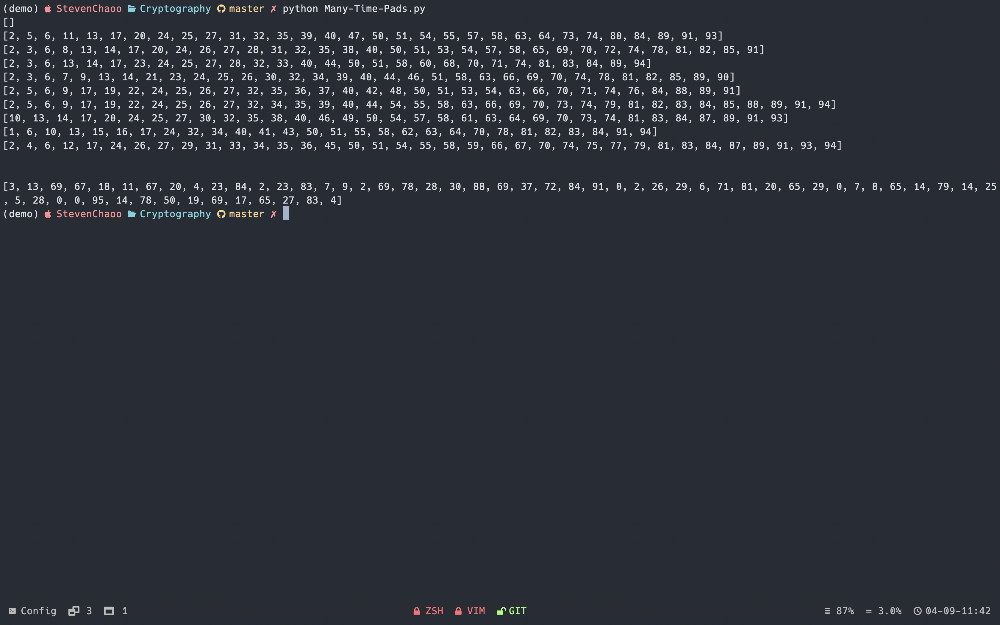

# Cryptography

> **Author: [StevenChaoo](https://github.com/StevenChaoo)**


This blog is written by **Neovim** and **Visual Studio Code**. You may need to clone this repository to your local and use **Visual Studio Code** to read. ***Markdown Preview Enhanced*** plugin is necessary as well.

## Contents

- [Cryptography](#cryptography)
  - [Contents](#contents)
  - [1. Many Time Pads](#1-many-time-pads)
  - [2. Tree Parity Machine](#2-tree-parity-machine)
    - [2.1 Process of TPM](#21-process-of-tpm)
    - [2.2 Protocol](#22-protocol)
    - [2.3 Property analysis](#23-property-analysis)
    - [2.4 Attacks and security of this protocol](#24-attacks-and-security-of-this-protocol)
      - [2.4.1 Brute force](#241-brute-force)
      - [2.4.2 Learning with own tree parity machine](#242-learning-with-own-tree-parity-machine)
      - [2.4.3 Other attacks](#243-other-attacks)

## 1. Many Time Pads

This is the first homework of Cryptography. The purpose of doing this homework is to show us why a stream cipher needs different $k$ in different process. **The idea comes from the homework of Dan Boneh's [CS255](https://crypto.stanford.edu/~dabo/courses/cs255_winter21/hw_and_proj/hw0.html) at Stanford University**

Let us see what goes wrong when a stream cipher key is used more than once. Below are eleven hex-encoded ciphertexts that are the result of encrypting eleven plaintexts with a stream cipher, all with the same stream cipher key. Your goal is to decrypt the last ciphertext, and submit the secret message within it as solution.

**HINT: XOR the ciphertexts together, and consider what happens when a space is XORed with a character in [a-zA-Z].**

The main idea to solve it is when space is XORed with a character, characters will switch between upper and lower case. When we traverse the entire data space, we can find the positions of the spaces in all the ciphertexts, and then XOR these ciphertexts with the target ciphertext to infer the target ciphertext.

Taking ciphertext 1 as example, use the first and subsequent ciphertexts to perform XOR operations, and output the positions where there may be spaces after the XOR operations between each two. By comparing the results of the first and all subsequent operations, it can be inferred that the probability of the first one being a space at the same position is relatively high.



We can tell that position 2, 3, 5, 6, 9,... must be space. When we use the first ciphertext and the target to perform the XOR operation, we can determine the message of these positions.

Position 2 equals to "E", so we consider position 2 of target ciphertext is "e". Position 6 equals to "C", so we consider position 6 of target ciphertext is "c". By traversing the entire sequence, we can infer some of the plaintext.

**The target ciphertext is "The secuet message is  When using stream cipher never use the key more than once"**

*Coding Implementation is as followed.*

```python
# Author: StevenChaoo
# -*- coding:UTF-8 -*-


import re


class Trans:
    '''
    Make some converts
    '''

    def trans0x2B(self, raw_data):
        '''
        Convert data from 0x to B
        '''
        b_data = bin(int(raw_data, 16))[2:]
        while len(b_data) % 4 != 0:
            b_data = "0" + b_data
        b_datas = re.findall(r'.{8}', b_data)
        return b_datas

    def transB2D(self, b_datas):
        '''
        Convert data from B to D
        '''
        d_datas = []
        for b_data in b_datas:
            d_data = int(b_data, 2)
            d_datas.append(d_data)
        return d_datas

    def transD2Char(self, d_datas):
        '''
        Convert data from D to Char
        '''
        char_data = ""
        for d_data in d_datas:
            char_data += chr(d_data)
        return char_data

    def determineSpace(self, d_datas):
        '''
        Determine if space in sequence
        '''
        index = []
        for i in range(len(d_datas)):
            if d_datas[i] < 65 or d_datas[i] > 90:
                d_datas[i] = 0
            else:
                index.append(i)
        return d_datas, index

    def xor(self, a, b):
        '''
        Let xor between a and b
        '''
        c = a ^ b
        return c

    def showKN(self, kn, k_list):
        '''
        Show index of letters
        '''
        l = []
        for k_x in k_list:
            for j in range(95):
                k = self.xor(kn[j], k_x[j])
                l.append(k)
            _, i = self.determineSpace(l)
            l = []
            print(i)


if __name__ == "__main__":
    # Datas
    c1 = "315c4eeaa8b5f8aaf9174145bf43e1784b8fa00dc71d885a804e5ee9fa40b16349c146fb778cdf2d3aff021dfff5b403b510d0d0455468aeb98622b137dae857553ccd8883a7bc37520e06e515d22c954eba5025b8cc57ee59418ce7dc6bc41556bdb36bbca3e8774301fbcaa3b83b220809560987815f65286764703de0f3d524400a19b159610b11ef3e"
    c2 = "234c02ecbbfbafa3ed18510abd11fa724fcda2018a1a8342cf064bbde548b12b07df44ba7191d9606ef4081ffde5ad46a5069d9f7f543bedb9c861bf29c7e205132eda9382b0bc2c5c4b45f919cf3a9f1cb74151f6d551f4480c82b2cb24cc5b028aa76eb7b4ab24171ab3cdadb8356f"
    c3 = "32510ba9a7b2bba9b8005d43a304b5714cc0bb0c8a34884dd91304b8ad40b62b07df44ba6e9d8a2368e51d04e0e7b207b70b9b8261112bacb6c866a232dfe257527dc29398f5f3251a0d47e503c66e935de81230b59b7afb5f41afa8d661cb"
    c4 = "32510ba9aab2a8a4fd06414fb517b5605cc0aa0dc91a8908c2064ba8ad5ea06a029056f47a8ad3306ef5021eafe1ac01a81197847a5c68a1b78769a37bc8f4575432c198ccb4ef63590256e305cd3a9544ee4160ead45aef520489e7da7d835402bca670bda8eb775200b8dabbba246b130f040d8ec6447e2c767f3d30ed81ea2e4c1404e1315a1010e7229be6636aaa"
    c5 = "3f561ba9adb4b6ebec54424ba317b564418fac0dd35f8c08d31a1fe9e24fe56808c213f17c81d9607cee021dafe1e001b21ade877a5e68bea88d61b93ac5ee0d562e8e9582f5ef375f0a4ae20ed86e935de81230b59b73fb4302cd95d770c65b40aaa065f2a5e33a5a0bb5dcaba43722130f042f8ec85b7c2070"
    c6 = "32510bfbacfbb9befd54415da243e1695ecabd58c519cd4bd2061bbde24eb76a19d84aba34d8de287be84d07e7e9a30ee714979c7e1123a8bd9822a33ecaf512472e8e8f8db3f9635c1949e640c621854eba0d79eccf52ff111284b4cc61d11902aebc66f2b2e436434eacc0aba938220b084800c2ca4e693522643573b2c4ce35050b0cf774201f0fe52ac9f26d71b6cf61a711cc229f77ace7aa88a2f19983122b11be87a59c355d25f8e4"
    c7 = "32510bfbacfbb9befd54415da243e1695ecabd58c519cd4bd90f1fa6ea5ba47b01c909ba7696cf606ef40c04afe1ac0aa8148dd066592ded9f8774b529c7ea125d298e8883f5e9305f4b44f915cb2bd05af51373fd9b4af511039fa2d96f83414aaaf261bda2e97b170fb5cce2a53e675c154c0d9681596934777e2275b381ce2e40582afe67650b13e72287ff2270abcf73bb028932836fbdecfecee0a3b894473c1bbeb6b4913a536ce4f9b13f1efff71ea313c8661dd9a4ce"
    c8 = "315c4eeaa8b5f8bffd11155ea506b56041c6a00c8a08854dd21a4bbde54ce56801d943ba708b8a3574f40c00fff9e00fa1439fd0654327a3bfc860b92f89ee04132ecb9298f5fd2d5e4b45e40ecc3b9d59e9417df7c95bba410e9aa2ca24c5474da2f276baa3ac325918b2daada43d6712150441c2e04f6565517f317da9d3"
    c9 = "271946f9bbb2aeadec111841a81abc300ecaa01bd8069d5cc91005e9fe4aad6e04d513e96d99de2569bc5e50eeeca709b50a8a987f4264edb6896fb537d0a716132ddc938fb0f836480e06ed0fcd6e9759f40462f9cf57f4564186a2c1778f1543efa270bda5e933421cbe88a4a52222190f471e9bd15f652b653b7071aec59a2705081ffe72651d08f822c9ed6d76e48b63ab15d0208573a7eef027"
    c10 = "466d06ece998b7a2fb1d464fed2ced7641ddaa3cc31c9941cf110abbf409ed39598005b3399ccfafb61d0315fca0a314be138a9f32503bedac8067f03adbf3575c3b8edc9ba7f537530541ab0f9f3cd04ff50d66f1d559ba520e89a2cb2a83"
    c_target = "32510ba9babebbbefd001547a810e67149caee11d945cd7fc81a05e9f85aac650e9052ba6a8cd8257bf14d13e6f0a803b54fde9e77472dbff89d71b57bddef121336cb85ccb8f3315f4b52e301d16e9f52f904"

    # Build Trans() class
    trans = Trans()

    # List of ciphertext
    c_list = [c1, c2, c3, c4, c5, c6, c7, c8, c9, c10]

    # Converting data from 0x to D
    k1 = trans.transB2D(trans.trans0x2B(c1))
    k2 = trans.transB2D(trans.trans0x2B(c2))
    k3 = trans.transB2D(trans.trans0x2B(c3))
    k4 = trans.transB2D(trans.trans0x2B(c4))
    k5 = trans.transB2D(trans.trans0x2B(c5))
    k6 = trans.transB2D(trans.trans0x2B(c6))
    k7 = trans.transB2D(trans.trans0x2B(c7))
    k8 = trans.transB2D(trans.trans0x2B(c8))
    k9 = trans.transB2D(trans.trans0x2B(c9))
    k10 = trans.transB2D(trans.trans0x2B(c10))
    k_target = trans.transB2D(trans.trans0x2B(c_target))

    # List of D type ciphertext
    k_list = [k1, k2, k3, k4, k5, k6, k7, k8, k9, k10]

    # Show index of letters
    trans.showKN(k2, k_list)

    l = []
    for i in range(60):
        k = trans.xor(k_target[i], k1[i])
        l.append(k)

    print('\n')
    print(l)
```

## 2. Tree Parity Machine

The most used protocol for key exchange between two parities A and B in the practice is Diffie-Hellman key exchange protocol. Neural key exchange, which is based on the synchronization of two tree parity machines, should be a scure replacement for this method. Synchronizing these two machines is similar to synchronizing two chaotic oscillators in chaos communications.

<div align="center">
<image src="Pics/CRY/2.png" width="70%">
</div>

### 2.1 Process of TPM

The tree parity machine is a special type of multi-layer feedforward neural network.

It consists of one ouput neuron, $K$ hidden neurons and $K\times N$ input neurons. Inputs to the network take three values:
$$x_{ij}\in \{-1, 0, +1\}$$

The weights between input and hidden neurons take the values:
$$w_{ij}\in\{-L,\cdots,0,\cdots,+L\}$$

Output value of each hidden neuron is calculated as a sum of all multiplications of input neurons and these weights:
$$\sigma_i=\mathrm{sgn}(\sum_{j=1}^Nw_{ij}x_{ij})$$

Signum is a simple function, which returns -1, 0 or 1:
$$
\mathrm{sgn}(x)=\left\{
\begin{array}{ccl}
-1 && x < 0\\
0 && x = 0\\
1 && x > 0
\end{array}\right.
$$

If the scalar product is 0, the output of the hidden neuron is mapped to -1 in order to ensure a binary output value. The output of neural network is then computed as the multiplication of all values produced by hidden elements:
$$\tau=\prod_{i=1}^K\sigma_i$$

Output of the tree parity machine is binary.

### 2.2 Protocol

Each party uses its own tree parity machine. Synchronization of the tree parity machines is achieved in these steps

1. Initialize random weight values
2. Execute these steps until the full synchronization is achieved
   1. Generate random input vector $X$
   2. Compute the values of the hidden neurons
   3. Compute the value of the output neuron
   4. Compare the values of both tree parity machines
      1. Outputs are the same: one of the suitable learning rules is applied to the weights
      2. Outputs are different: go to 2.1

After the full synchronization is achieved (the weights $w_{ij}$ of both tree parity machines are same), A and B can use their weights as keys.

This method is known as a bidirectional learning. One of the following learning rules can be used for the synchronization:

- Hebbian learning rule:
  $$w_i^+ = g(w_i + \sigma_ix_i\theta(\sigma_i,\tau^A)\theta(\tau^A, \tau^B))$$
- Anti-Hebbian learning rule:
  $$w_i^+ = g(w_i - \sigma_ix_i\theta(\sigma_i,\tau^A)\theta(\tau^A, \tau^B))$$
- Random walk:
  $$w_i^+ = g(w_i + x_i\theta(\sigma_i,\tau^A)\theta(\tau^A, \tau^B))$$

where:
$$
\theta(a,b)=\left\{
\begin{array}{ccl}
0 && a\ne b\\
1 && a = b
\end{array}\right.
$$

### 2.3 Property analysis

During steps above, if there exists at least one common hidden unit with $\sigma_k=\tau$ in the two networks, then there are three possibilities that characterize the behavior of the hidden nodes:

1. An attractive move: if hidden units at similar $k$ positions have equal output bits, $\sigma_k^A=\sigma_k^B=\tau^{A/B}$
2. A repulsive move: if hidden units at similar $k$ positions have unequeal output bits, $\sigma_k^A\ne\sigma_k^B$
3. No move: when $\sigma_k^A=\sigma_k^B\ne\tau^{A/B}$

The distance between hidden units can be defined by their mutual overlap, $\rho$
$$\rho=1-\frac{1}{K}\sum_{k=1}^K\frac{|w_k^A-w_k^B|}{2L}$$

where $0<\rho<1$m with $\rho=0$ at the start of learning and $\rho=1$ when  synchronization occurs with the two hidden units having a common weight vector.

The weights are restricted to be discrete, i.e. $W\in\{-L,\cdots,0,\cdots,L\}$ so there are $m=2L+1$ values for each weight. At each training step, each weight is affected by a change of either $+1, 0$ or $-1$. Since the weights are discrete closed set, the weight is left unchanged if it hits either of the two boundaries $L$ or $-L$. Therefore, the mutual learning process with TPM is identical to a group of random walks with reflecting boundaries.

<div align="center">
<image src="Pics/CRY/3.png" width="70%">
</div>

This figure represents two random walkers moving in one dimensional line of $m$ locations. The distance between the two walkers is represented by the parameter $d$ while $z$ refers to the initial position of the left walker. At each step, a direction, either left or right, is selected randomly. The two walkers moves towards the same direction. If one of the walkers reaches one of the boundaries, it remains unchanged. Since the other walker is not affected, it will continue moving so that $d$ decreases by 1 at each step until it reaches zero. Since the two walkers synchronize at the boundaries, they remain synchronized even if they moved in random walks. The time needed to reach synchronization, $T$, is characterized by the number of steps until $d$ reaches zero.

### 2.4 Attacks and security of this protocol

In every attack it is considered, that the attacker E can eavesdrop messages between the parities A and B, but does not have an opportunity to change them.

#### 2.4.1 Brute force

To provide a brute force attack, an attacker has to test all possible keys. By $K$ hidden neurons, $K\times N$ input neurons and boundary of weights $L$, this gives $(2L+1)^{KN}$ possibilities.

#### 2.4.2 Learning with own tree parity machine

One of the basic attacks can be provided by an attacker, who owns the same tree parity machine as the parties A and B. He wants to synchronize his tree parity machine with these two parties. In each step there are three situations possible:

1. Output(A) $\ne$ Output(B): None of the parties updates its weights.
2. Output(A) $=$ Output(B) $=$ Output(E): All the three parties update weights in their tree parity machines.
3. Output(A) $=$ Output(B) $\ne$ Output(E): Parties A and B update their tree parity machines, but the attacker can not do that. Because of this situation his learning is slower than the synchronization of parties A and B.

It has been proven, that the synchronization of two parties is faster than learning of an attacker. It can be improved by increasing of the synaptic depth L of the neural network. That gives this protocol enough security and an attacker can find out the key only with small probability.

#### 2.4.3 Other attacks

For conventional cryptographic systems, we can improve the security of the protocol by increasing of the key length. In the case of neural cryptography, we improve it by increasing of the synaptic depth L of the neural networks. Changing this parameter increases the cost of a successful attack exponentially, while the effort for the users grows polynomially. Therefore, breaking the security of neural key exchange belongs to the complexity class NP.

Alexander Klimov, Anton Mityaguine, and Adi Shamir say that the original neural synchronization scheme can be broken by at least three different attacks—geometric, probabilistic analysis, and using genetic algorithms. Even though this particular implementation is insecure, the ideas behind chaotic synchronization could potentially lead to a secure implementation.

*Coding Implementation is as followed.*

```python
# Author: StevenChaoo
# -*- coding:UTF-8 -*-


import numpy as np
import matplotlib.pyplot as mpl
import sys
import time


class UpdateRules():
    '''
    One of the following learning rules can be used for the synchronization:
       -Hebbian learning rule:
        w_i = w_i + \sigma_i\times x_i\times\theta(\sigma_i,\tau^A)\theta(\tau^A, \tau^B)
       -Anti-Hebbian learning rule:
        w_i = w_i - \sigma_i\times x_i\times\theta(\sigma_i,\tau^A)\theta(\tau^A, \tau^B)
       -Random walk:
        w_i = w_i + x_i\times\theta(\sigma_i,\tau^A)\theta(\tau^A, \tau^B)
    '''

    def theta(self, t1, t2):
        '''
        Param:
            t1:
            t2:
        Return:
            a bool value
        '''
        return 1 if t1 == t2 else 0

    def hebbian(self, W, X, sigma, tau1, tau2, l):
        '''
        Hebbian learning rule
        Param:
            W:     weights in neural network
            X:     inputs of neural network
            sigma: \sigma_i = \sum w_i\times x_i
            tau1:  tau^A \tau = \prod\sigma_i
            tau2:  tau^B \tau = \prod\sigma_i
            l:     the depth of network
        '''
        k, n = W.shape
        for (i, j), _ in np.ndenumerate(W):
            W[i, j] += X[i, j] * sigma[i] * \
                self.theta(sigma[i], tau1) * self.theta(tau1, tau2)
            W[i, j] = np.clip(W[i, j], -l, l)

    def anti_hebbian(self, W, X, sigma, tau1, tau2, l):
        '''
        Anti-Hebbian learning rule
        Param:
            W:     weights in neural network
            X:     inputs of neural network
            sigma: \sigma_i = \sum w_i\times x_i
            tau1:  tau^A \tau = \prod\sigma_i
            tau2:  tau^B \tau = \prod\sigma_i
            l:     the depth of network
        '''
        k, n = W.shape
        for (i, j), _ in np.ndenumerate(W):
            W[i, j] -= X[i, j] * sigma[i] * \
                self.theta(sigma[i], tau1) * self.theta(tau1, tau2)
            W[i, j] = np.clip(W[i, j], -l, l)

    def random_walk(self, W, X, sigma, tau1, tau2, l):
        '''
        Ranfom walk learning rule
        Param:
            W:     weights in neural network
            X:     inputs of neural network
            sigma: \sigma_i = \sum w_i\times x_i
            tau1:  tau^A \tau = \prod\sigma_i
            tau2:  tau^B \tau = \prod\sigma_i
            l:     the depth of network
        '''
        k, n = W.shape
        for (i, j), _ in np.ndenumerate(W):
            W[i, j] += X[i, j] * \
                self.theta(sigma[i], tau1) * self.theta(tau1, tau2)
            W[i, j] = np.clip(W[i, j], -l, l)


class Machine:
    '''
    To build a machine for synchrony the weight
    Param:
        k: the number of kernals
        n: the number of input neuron per kernal
        l: the depth of network
        W: weights in neural network
    '''

    def __init__(self, k=3, n=4, l=6):
        self.k = k
        self.n = n
        self.l = l
        self.W = np.random.randint(-l, l + 1, [k, n])

    def get_output(self, X):
        '''
        Calculate the final score
        Param:
            X: inputs of neural network
        Return:
            tau: final score
        '''
        k = self.k
        n = self.n

        # initialized with np.random.randint function
        W = self.W

        # reshape X in same size to W
        X = X.reshape([k, n])

        # np.sign function to get the sign of the value
        # np.sum function to find the sum of all elements in the matrix
        sigma = np.sign(np.sum(X * W, axis=1))

        # np.prod function to find the product of all elements in the matrix
        tau = np.prod(sigma)

        self.X = X
        self.sigma = sigma
        self.tau = tau

        return tau

    def __call__(self, X):
        '''
        Overriding overloaded function
        '''
        return self.get_output(X)

    def update(self, tau2, update_rule='random_walk'):
        '''
        Update the weight matrix
        Param:
            tau2: tau^B
            update_rule: learning update rules, default is random_walk
        '''
        rules = UpdateRules()
        X = self.X
        tau1 = self.tau
        sigma = self.sigma
        W = self.W
        l = self.l

        if (tau1 == tau2):
            if update_rule == 'hebbian':
                rules.hebbian(W, X, sigma, tau1, tau2, l)
            elif update_rule == 'anti_hebbian':
                rules.anti_hebbian(W, X, sigma, tau1, tau2, l)
            elif update_rule == 'random_walk':
                rules.random_walk(W, X, sigma, tau1, tau2, l)
            else:
                raise Exception("Invalid update rule. Valid update rules are: " +
                                "\'hebbian\', \'anti_hebbian\' and \'random_walk\'.")


def random(k, n, l):
    '''
    Initialize the input matrix
    Param:
        k: the number of kernals
        n: the number of input neuron per kernal
        l: the depth of network
    Return:
        the initialized input matrix
    '''
    return np.random.randint(-l, l + 1, [k, n])


def sync_score(m1, m2, l):
    '''
    Calculate the synchronized score
    Param:
        m1:
        m2:
        l:  the depth of network
    Return:
        the value description of how different between m1 and m2
    '''
    return 1.0 - np.average(1.0 * np.abs(m1.W - m2.W)/(2 * l))


if __name__ == "__main__":

    # Hyper-parameters
    k = 100
    n = 10
    l = 10

    # Alternative learning rules
    update_rules = ['hebbian', 'anti_hebbian', 'random_walk']
    update_rule = update_rules[0]

    print("Creating machines : k=" + str(k) +
          ", n=" + str(n) + ", l=" + str(n))
    print("Using " + update_rule + " update rule.")

    # Instantiate object
    Alice = Machine(k, n, l)
    Bob = Machine(k, n, l)
    Eve = Machine(k, n, l)

    sync = False
    nb_updates = 0
    nb_eve_updates = 0
    sync_history = []

    # Start the timer
    start_time = time.time()

    while(not sync):

        # Initialize the input matrix
        X = random(k, n, l)

        # Get the final score of Alice, Bob and Eve
        tauA = Alice(X)
        tauB = Bob(X)
        tauE = Eve(X)

        # Update the weights
        Alice.update(tauB, update_rule)
        Bob.update(tauA, update_rule)

        # Eve updates the weights
        if tauA == tauB == tauE:
            Eve.update(tauA, update_rule)
            # Statistics Eve update times
            nb_eve_updates += 1

        # Statistics Alice and Bob update times
        nb_updates += 1

        # Calculate the synchronized score
        score = 100 * sync_score(Alice, Bob, l)

        sys.stdout.write('\r' + "Synchronization = " + str(int(score)) + "%    Updates = " +
                         str(nb_updates) + "    Eve's updates = " + str(nb_eve_updates))

        # Synchronization complete
        if score == 100:
            sync = True

        # For plot
        sync_history.append(score)

    # Stop the timer and calculate the time difference
    end_time = time.time()
    time_taken = end_time - start_time

    print('\nMachines have been synchronized.')
    print('Time taken = ' + str(time_taken)[:6] + " seconds.")
    print('Updates = ' + str(nb_updates) + ".")

    eve_score = 100 * int(sync_score(Alice, Eve, l))
    if eve_score > 100:
        print("Oops! Nosy Eve synced her machine with Alice's and Bob's !")
    else:
        print("Eve's machine is only " + str(eve_score) + " % " +
              "synced with Alice's and Bob's and she did " + str(nb_eve_updates) + " updates.")

    mpl.plot(sync_history)
    mpl.show()
```
