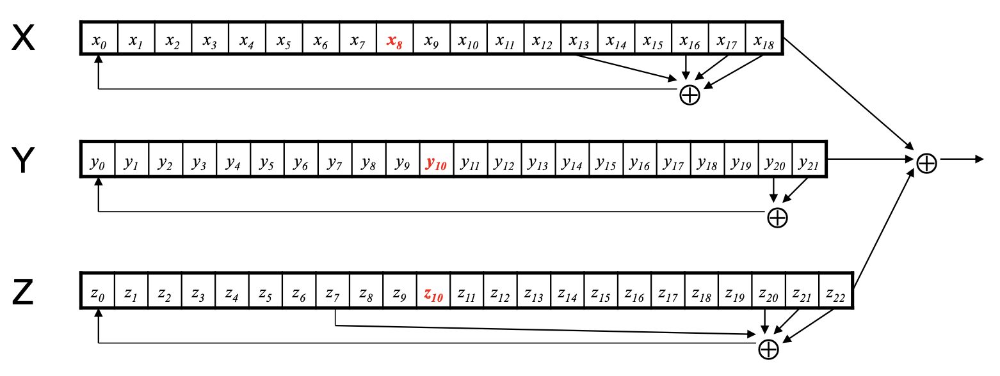
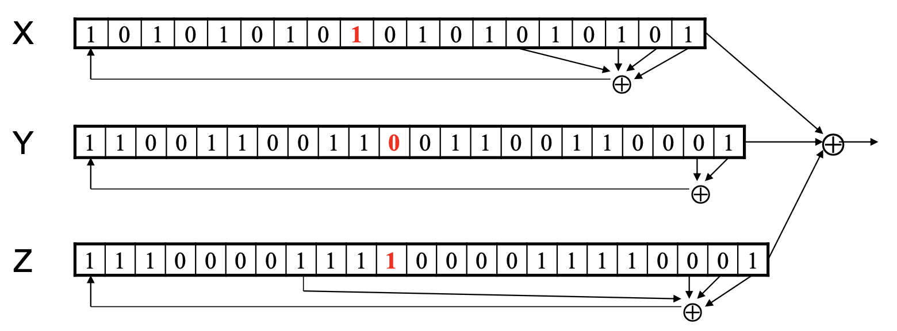
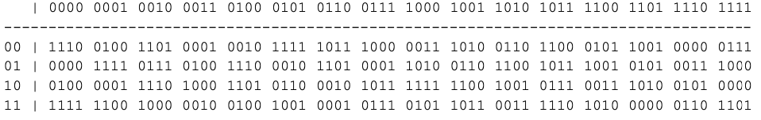

# Cyberspace Security

> **Author: [StevenChaoo](https://github.com/StevenChaoo)**


This blog is written by **Neovim** and **Visual Studio Code**. You may need to clone this repository to your local and use **Visual Studio Code** to read. ***Markdown Preview Enhanced*** plugin is necessary as well.

## Contents

- [Cyberspace Security](#cyberspace-security)
  - [Contents](#contents)
  - [1. Preview of class](#1-preview-of-class)
    - [1.1 Course content](#11-course-content)
    - [1.2 Inspection](#12-inspection)
  - [2. Crypto Introduction](#2-crypto-introduction)
    - [2.1 Terms](#21-terms)
      - [2.1.1 Professional vocabulary](#211-professional-vocabulary)
      - [2.1.2 Explaination of Crypto](#212-explaination-of-crypto)
    - [2.2 Basic asssumptions](#22-basic-asssumptions)
    - [2.3 Process of encrypt and decrypt](#23-process-of-encrypt-and-decrypt)
      - [2.3.1 A generic view of symmetric key crypto](#231-a-generic-view-of-symmetric-key-crypto)
      - [2.3.2 Simple Substitution](#232-simple-substitution)
    - [2.4 History of crypto](#24-history-of-crypto)
      - [2.4.1 Early 20th Century](#241-early-20th-century)
      - [2.4.2 Post-WWII](#242-post-wwii)
    - [2.5 Taxonomy of Cryptography](#25-taxonomy-of-cryptography)
  - [3. Symmetric Key Crypto](#3-symmetric-key-crypto)
    - [3.1 Stream Ciphers](#31-stream-ciphers)
      - [3.1.1 A5/1](#311-a51)
        - [I-Shift Registers](#i-shift-registers)
        - [II-Keystream of A5/1](#ii-keystream-of-a51)
        - [III-Process of A5/1](#iii-process-of-a51)
        - [IV-Summary of Shift Register Crypto](#iv-summary-of-shift-register-crypto)
      - [3.1.2 RC4](#312-rc4)
        - [I-Process of RC4](#i-process-of-rc4)
        - [II-Initialization](#ii-initialization)
        - [III-Keystream of RC4](#iii-keystream-of-rc4)
      - [3.1.3 Summary of Stream Ciphers](#313-summary-of-stream-ciphers)
    - [3.2 Block Ciphers](#32-block-ciphers)
      - [3.2.1 Meaning of Block Ciphers](#321-meaning-of-block-ciphers)
      - [3.2.2 Feistel Cipher](#322-feistel-cipher)
        - [I-Encryption](#i-encryption)
        - [II-Decryption](#ii-decryption)
      - [3.2.3 DES(Data Encryption Standard)](#323-desdata-encryption-standard)
        - [I-What is DES](#i-what-is-des)
        - [II-DES's S-box](#ii-dess-s-box)
        - [III-Subkey](#iii-subkey)
        - [IV-Summary of DES](#iv-summary-of-des)
        - [V-Security of DES](#v-security-of-des)
        - [VI-Triple DES](#vi-triple-des)
      - [3.2.4 AES(Advanced Encryption Standard)](#324-aesadvanced-encryption-standard)
        - [I-What is AES](#i-what-is-aes)
      - [3.2.5 Block Cipher Modes](#325-block-cipher-modes)
    - [3.3 Integrity](#33-integrity)
      - [3.3.1 Data Integrity](#331-data-integrity)
      - [3.3.2 MAC](#332-mac)
        - [I-Computation of MAC](#i-computation-of-mac)
        - [II-Confidentiality and Integrity of MAC](#ii-confidentiality-and-integrity-of-mac)
  - [4. Public Key Cryptography](#4-public-key-cryptography)
    - [4.1 RSA](#41-rsa)
      - [4.1.1 Description of RSA](#411-description-of-rsa)
      - [4.1.2 How RSA really work?](#412-how-rsa-really-work)
    - [4.2 Diffie-Hellman](#42-diffie-hellman)
      - [4.2.1 Diffie-Hellman Key Exchange](#421-diffie-hellman-key-exchange)
      - [4.2.2 Process of Diffie-Hellman Key Exchange](#422-process-of-diffie-hellman-key-exchange)
      - [4.2.3 Man-in-the-middle Attack (MiM)](#423-man-in-the-middle-attack-mim)
    - [4.3 Uses for Public Key Crypto](#43-uses-for-public-key-crypto)
    - [4.4 Sign and Encrypt vs Encrypt and Sign](#44-sign-and-encrypt-vs-encrypt-and-sign)
      - [4.4.1 Sign and Encrypt](#441-sign-and-encrypt)
      - [4.4.2 Encrypt and Sign](#442-encrypt-and-sign)
    - [4.5 Public Key Infrastructure](#45-public-key-infrastructure)
      - [4.5.1 Certificate Authority](#451-certificate-authority)
      - [4.5.2 PKI](#452-pki)
      - [4.5.3 PKI Trust Models](#453-pki-trust-models)
    - [4.6 Hash](#46-hash)
      - [4.6.1 Crypto Hash Function](#461-crypto-hash-function)
      - [4.6.2 Birthday Problem -- a popular problem of hash](#462-birthday-problem----a-popular-problem-of-hash)
      - [4.6.3 Non-Crypto Hash](#463-non-crypto-hash)
        - [I Example 1](#i-example-1)
        - [II Example 2](#ii-example-2)
        - [III Example 3](#iii-example-3)
      - [4.6.4 Popular Crypto Hashes](#464-popular-crypto-hashes)
      - [4.6.5 HMAC](#465-hmac)
        - [I How to compute HMAC?](#i-how-to-compute-hmac)
        - [II Correct Way to HMAC](#ii-correct-way-to-hmac)
  - [5. Authentication](#5-authentication)
    - [5.1 Password](#51-password)
      - [5.1.1 Why Passwords?](#511-why-passwords)
      - [5.1.2 Password File?](#512-password-file)
      - [5.1.3 Dictionary Attack](#513-dictionary-attack)
      - [5.1.4 Password Cracking Tools](#514-password-cracking-tools)
    - [5.2 Biometrics](#52-biometrics)
      - [5.2.1 Why Biometrics?](#521-why-biometrics)
      - [5.2.2 Biometric characteristics](#522-biometric-characteristics)
      - [5.2.3 Biometric Errors](#523-biometric-errors)
      - [5.2.4 Fingerprint](#524-fingerprint)
        - [I History](#i-history)
        - [II Comparison](#ii-comparison)
        - [III Enrollment](#iii-enrollment)
        - [IV Recognition](#iv-recognition)
      - [5.2.5 Hand Geometry](#525-hand-geometry)
      - [5.2.6 Iris Patterns](#526-iris-patterns)
        - [I History](#i-history-1)
        - [II Scan](#ii-scan)
        - [III Measuring Similarity](#iii-measuring-similarity)
        - [IV Attack](#iv-attack)
      - [5.2.7 Summary of Biometrics](#527-summary-of-biometrics)
        - [I Equal Error Rate Comparison](#i-equal-error-rate-comparison)
        - [II The Bottom Line](#ii-the-bottom-line)
  - [6. Protocols](#6-protocols)
    - [6.1 Ideal Security Protocol](#61-ideal-security-protocol)
    - [6.2 Authentication Protocols](#62-authentication-protocols)
      - [6.2.1 Authentication](#621-authentication)
      - [6.2.2 Simple Authentication](#622-simple-authentication)
      - [6.2.3 Authentication Attack](#623-authentication-attack)
      - [6.2.4 Better Authentication](#624-better-authentication)
    - [6.3 Challenge-Response](#63-challenge-response)
      - [6.3.1 Nonce](#631-nonce)
      - [6.3.2 Symmetric Key Notation](#632-symmetric-key-notation)
      - [6.3.3 Mutual Authentication](#633-mutual-authentication)
      - [6.3.4 Public Key Notation](#634-public-key-notation)
      - [6.3.5 Session Key](#635-session-key)
    - [6.4 Timestamps](#64-timestamps)
    - [6.5 Perfect Forward Secrecy](#65-perfect-forward-secrecy)
    - [6.6 Real World Protocols](#66-real-world-protocols)
      - [6.6.1 Secure Shell (SSH)](#661-secure-shell-ssh)
        - [I Simplified SSH](#i-simplified-ssh)
        - [II MiM Attack on SSH?](#ii-mim-attack-on-ssh)
      - [6.6.2 Secure Socket Layer (SSL)](#662-secure-socket-layer-ssl)
        - [I What is SSL?](#i-what-is-ssl)
        - [II Simplified SSL Protocol](#ii-simplified-ssl-protocol)
        - [III SSL Sessions vs Connections](#iii-ssl-sessions-vs-connections)
        - [IV SSL Connection](#iv-ssl-connection)
        - [V SSL vs IPSec](#v-ssl-vs-ipsec)
  
## 1. Preview of class

### 1.1 Course content

- Crypto
- Certification
- Network Security Protocol Fundamentals
- Network security protocol case
- ZKP

### 1.2 Inspection

**Usual score accounts for 40%**:

- Attendance *(60 points)*
  1. **4** points per time
  2. **4** points deducted for one absence
  3. **2** points deducted for being late
  4. No points will be deducted for sick leave, 2 points will be deducted for private matters

- Homework *(40 points)*
  1. 20 points per time

**Final score accounts for 60%**:

- Report

## 2. Crypto Introduction

### 2.1 Terms

#### 2.1.1 Professional vocabulary

- **Cryptology**: The art and science of **making** and **breaking** "secret codes"
- **Cryptography**: **making** "secret codes"
- **Cryptanalysis**: **breaking** "secret codes"
- **Crypto**: all of the above (and more)

#### 2.1.2 Explaination of Crypto

- A **cipher** or **cryptosystem** is used to **encrypt** the **plaintext**
- The result of encryption is **ciphertext**
- We **decrypt** ciphertext to recover plaintext
- A **key** is used to configure a cryptosystem
- A **symmetric key** cryptosystem uses the same key to encrypt as to decrypt
- A **public key** cryptosystem uses a **public key** to encrypt and a **private key** to decrypt

### 2.2 Basic asssumptions

This is known as **Kerckhoffs' Principle**

- The system is completely known to the attacker
- Only the key is secret
- That is, crypto algorithms are not secret

Why do we make such an assumption?

- Experience has shown that secret algorithms tend to be weak when exposed
- Secret algorithms never remain secret
- Better to find weaknesses beforehand

### 2.3 Process of encrypt and decrypt

#### 2.3.1 A generic view of symmetric key crypto

(Encrypt and decrypt with the same key.)

```flow
st=>start: plaintext
op1=>operation: encrypt
op2=>operation: ciphertext
op3=>operation: decrypt
op4=>operation: key
e=>end: plaintext
st(right)->op1(right)->op2(right)->op3(right)->e
```

#### 2.3.2 Simple Substitution

**Plaintext**: spongebobsquarepants\
**key**:
| Plaintext  | a | b | c | d | e | f | ... | x | y | z |
|------------|---|---|---|---|---|---|-----|---|---|---|
| Ciphertext | d | e | f | g | h | i | ... | a | b | c |

**ciphertext**: vsrqjherevtxduhsdqwv

### 2.4 History of crypto

#### 2.4.1 Early 20th Century

- WWI -- Zimmeiman Telegram
- "Gentlemen do not read each other's mail"
  - Henry L. Stimson, Secretary of State, 1929
- WWII -- golden age of cryptanalysis
  - Midway/Coral Sea
  - Japanese **Purple** (codename MAGIC)
  - German **Enigma** (codename ULTRA)

#### 2.4.2 Post-WWII

- Claude Shannon -- father of the science of information theory
- Computer revolution -- lots of data to protect
- **Data Encryption Standard (DES)**, 70's
- Public Key cryptography, 70's
- CRYPTO conferences, 80's
- **Advanced Encryption Standard (AES)**, 90's
- The crypto genie is out of the bottle

### 2.5 Taxonomy of Cryptography

- **Symmetric Key**
  - Same key for encryption and decryption
  - Modern types: Stream ciphers, Block ciphers
- **Public Key** (or "asymmetric" crypto)
  - Two keys, one for encryption(public), and one for decryption(private)
  - And digital signatures -- nothing comparable in symmetric key crypto
- **Hash algorithms**
  - Can be viewed as "one way" crypto

## 3. Symmetric Key Crypto

- **Stream cipher** -- generalize one-time pad
  - Except that key is relativately short
  - Key is stretched into a long **keystream**
  - Keystream is used just like a one-time pad
- **Block cipher** -- generalized codebook
  - Block cipher key determines a codebook
  - Each key yields a different codebook
  - Employs both "confusion" and "diffusion"

### 3.1 Stream Ciphers

- Once upon a time, not so very long age, stream ciphers were the king of crypto
- Today, not as popular as block ciphers
- We'll discuss two stream ciphers:
  - **A5/1**
    - Based on shift registers
    - Used in GSM mobile phone system
  - **RC4**
    - Based on a changing lookup table
    - Used many places

#### 3.1.1 A5/1

##### I-Shift Registers

- **A5/1 uses 3 shift registers**
  - **X**: 19 bits ($ x_0,x_1,x_2,...,x_{18} $)
  - **Y**: 22 bits ($ y_0,y_1,y_2,...,y_{21} $)
  - **Z**: 23 bits ($ z_0,z_1,z_2,...,z_{22} $)

##### II-Keystream of A5/1

- **At each iteration**: $ m=\mathrm{maj}(x_8,y_{10},z_{10}) $
  - **Examples**: $ \mathrm{maj}(0,1,0)=0 $ and $ \mathrm{maj}(1,1,0)=1 $
- **If $ x_8=m $ then X *steps***
  - $ t=x_{13}\bigoplus x_{16}\bigoplus x_{17}\bigoplus x_{18} $
  - $ x_i=x_{i-1} $ for $ i=18,17,...,1 $ and $ x_0=t $
- **If $ y_{10}=m $ then Y *steps***
  - $ t=y_{20}\bigoplus y_{21} $
  - $ y_i=y_{i-1} $ for $ i=21,20,...,1 $ and $ y_0=t $
- **If $ z_{10}=m $ then Z *steps***
  - $ t=z_7\bigoplus z_{20}\bigoplus z_{21}\bigoplus z_{22} $
  - $ z_i=z_{i-1} $ for $ i=22,21,...,1 $ and $ z_0=t $
- **Keystream bit is** $ x_{18}\bigoplus y_{21}\bigoplus z_{22} $

##### III-Process of A5/1



- Each variable here is a single bit
- Key is used as initial fill of registers
- Each register steps (or not) based on $ \mathrm{maj}(x_8,y_{10},z_{10}) $
- Keystream bit is XOR of rightmost bits of registers



- In this example, $ m=\mathrm{maj}(x_8,y_{10},z_{10})=\mathrm{maj}(1,0,1)=1 $
- Register X steps, Y does not step, and Z steps
- Keystream bit is XOR of right bits of regitsters
- Here, keystream bit will be $ 0\bigoplus 1\bigoplus 0=1 $

##### IV-Summary of Shift Register Crypto

- Shift register crypto efficient in hardware
- Often, slow if implemented in software
- In the past, very, very popular
- Today, more is done in software due to fast processors
- Shift register crypto still used some
  - Especially in resource-constrained devices

#### 3.1.2 RC4

##### I-Process of RC4

- A self-modifying lookup table
- Table always contains a permutation of the byte values 0,1,...,255
- Initialize the permutation using key
- At each step, RC4 does the following
  - Swaps elements in current lookup table
  - Selects a keystream byte from table
- Each step of RC4 produces a byte
  - Efficient in software
- Each step of A5/1 produces only a bit
  - Efficient in hardware

##### II-Initialization

- S[ ] is permutation of 0,1,...,255
- key[ ] contains N bytes of key

```vim
for i = 0 to 255
    S[i] = i
    K[i] = key[i (mod N)]
next i
j = 0
for i = 0 to 255
    j = (j + S[i] + K[i]) mod 256
    swap(S[i], S[j])
next j
i = j = 0
```

##### III-Keystream of RC4

- At each step, swap elements in table and select keystream byte

```vim
i = (i + 1) mod 256
j = (j + S[i]) mod 256
swap(S[i], S[j])
t = (S[i] + S[j]) mod 256
keystreamByte = S[t]
```

- Use keystream bytes like a one-time pad
- **Note**: first 256 bytes should be discarded
  - Otherwise, related key attack exists

#### 3.1.3 Summary of Stream Ciphers

- Stream ciphers were popular in the past
  - Efficient in hardware
  - Speed was needed to keep up with voice, etc
  - Today, processors are fast, so software-based crypto is usually more than fast enough
- Future of stream ciphers?
  - Shamir declared "the death of stream ciphers"
  - May be greatly exaggerated

### 3.2 Block Ciphers

#### 3.2.1 Meaning of Block Ciphers

- Plaintext and ciphertext consist of fixed-sized blocks
- Ciphertext obtained from plaintext by iterating a **round function**
- Input to round function consists of **key** and **output** of previous round
- Usually implemented in software

#### 3.2.2 Feistel Cipher

##### I-Encryption

- **Feistel cipher** is a type of block cipher but a specific block cipher
- Split plaintext block into **left** and **right** halves: $ P=(L_0,R_0) $
- For each round $ i=1,2,...,n $, compute
$ L_i=R_{i-1} $
$ R_i=L_{i-1}\bigoplus F(R_{i-1},R_n) $
where F is **round function** and $ K_i $ is **subkey**
- Ciphertext: $ C=(L_n,R_n) $

##### II-Decryption

- Start with ciphertext $ C=(L_n,R_n) $
- For each round $ i=n,n-1,...,1 $, compute
$ R_{i-1} = L_i $
$ L_{i-1} = R_i\bigoplus F(R_{i-1},K_i) $
where F is **round function** and $ K_i $ is **subkey**
- Plaintext: $ P=(L_0,R_0) $
- Decryption works for any function F but only secure for certain functions F

#### 3.2.3 DES(Data Encryption Standard)

- **DES** developed in 1970's
- Based on IBM's **Lucifer cipher**
- DES was U.S. government standard
- DES was controversial
  - NSA secretly involved
  - Design process was secret
  - Key length reduced from 128 to 56 bits
  - Subtle changes to Lucifer algorithm

##### I-What is DES

- DES is a Feistel cipher with:
  - 64 bit block length
  - 56 bit key length
  - 16 rounds
  - 48 bits of key used each round(subkey)
- Round function is simple(For block cipher)
- Security depends heavily on "S-boxes"
  - Each S-box maps 6 bits to 4 bits

<div align="center">
  <image src="Pics/NST/3.png" width="50%">
</div>

##### II-DES's S-box

- Each S-box maps 6 bits to 4 bits
- Here is S-box number 1:



##### III-Subkey

- For rounds 1, 2, 9 and 16 the shift $ r_i $ is 1, and in all other rounds $ r_i $ is 2
- Bits 8, 17, 21, 24 of LK omitted each round
- Bits 6, 9, 14, 25 of RK omitted each round
- **Compression permutation** yields 48 bit subkey $ K_i $ from 56 bits of LK and RK
- **Key schedule** generates subkey

##### IV-Summary of DES

- An initial permutation before round 1
- Halves are swapped after last round
- A final permutation(inverse of initial perm) applied to $ (R_{16},L_{16}) $
- None of this serves any security purpose

##### V-Security of DES

- Security depends heavily on S-boxes(Everything else in DES is linear)
- 35+ years of intense analysis has revealed no back door
- Attacks, essentially exhaustive key search
- **Inescapable conclusions**
  - Designers of DES knew that they were doing
  - Designers of DES were way ahead of their time(wrt certain cryptanalytic techniques)

##### VI-Triple DES

- Today, 56 bit DES key is too small
  - Exhaustive key search is feasible
- But DES is everywherem, so what to do?
- **Triple DES** or **3DES**(112 bit key)
  - $ C=E(D(E(P,K_1),K_2),K_1) $
  - $ P=D(E(D(C,K_1),K_2),K_1) $
- Why Encrypy-Decrypt-Encrypt with 2 keys?
  - Backward compatibl: $ E(D(E(P,K),K),K) = E(P,K) $
  - And 112 is a lot of bits
- Why not $ C=E(E(P,K),K) $ instead?
  - Trick question--still just 56 bit key
- Why not $ C=E(E(P,K_1),K_2) $ instead?
- A **known plaintext** attack
  - Pre-compute table of $ E(P,K_1) $ for every possible key $ K_1 $
  - Then for each possible $ K_2 $ compute $ D(C,K_2) until a match in table is found
  - When match is found, have $ E(P,K_1)=D(C,K_2) $

#### 3.2.4 AES(Advanced Encryption Standard)

- Replacement for DES
- AES competition(late 90's)
  - NSA openly involved
  - Transparent selection process
  - Many strong algorithms proposed
  - Rijndael Algorithm ultimately selected
- Iterated block cipher
- Not a Feistel cipher

##### I-What is AES

- **Block size**: 128 bits
- **Key length**: 128, 192 or 256 bits
- 10 to 14 rounds(depends on key length)
- Each round uses 4 functions:
  - **Byte Sub**
  - **Shift Row**
  - **Mix Column**
  - **Add Round Key**

#### 3.2.5 Block Cipher Modes

- Electronic Codebook(**ECB**) mode
  - Encrypt each block independently
  - Most obvious approach, but a bad idea
  - **Same plaintext yields same ciphertext!**
- Cipher Block Chaining(**CBC**) mode
  - Chain the blocks together
  - More secure than ECB, virtually no extra work
  - **Need random initialization vector(IV)**
- Counter Mode(**CTR**) mode
  - Block ciphers acts like a stream cipher
  - Popular for random access

### 3.3 Integrity

#### 3.3.1 Data Integrity

- **Integrity**--detect unauthorized writing (i.e., detect unauthorized mod of data)
- Example: Inter-bank fund transfers
  - Confidentiality may be nice, integrity is critical
- Encryption provides confidentiality (prevents unauthorized disclosure)
- Encryption alone does not provide integrity
  - One-time pad, ECB cut-and-paste, etc., etc.

#### 3.3.2 MAC

- Message Authentication Code(MAC)
  - Used for data **integrity**
  - Integrity not the same as confidentiality
- MAC is computed as **CBC residue**
  - That is, compute CBC encryption, saving only final ciphertext block, the MAC
  - The MAC serves as a cryptographic checksum for data

##### I-Computation of MAC

- MAC computation(assuming N blocks)
$ C_0=E(IV\bigoplus P_0,K) $
$ C_0=E(C_0\bigoplus P_1,K) $
$ C_0=E(C_1\bigoplus P_2,K) $
$ ... $
$ C_0=E(C_{N-2}\bigoplus P_{N-1},K)=MAC $
- Send all param and MAC
- Both sender and receiver must know K

##### II-Confidentiality and Integrity of MAC

- Encrypt with one key, MAC with another key
- Why not use the same key?
  - Send last encrypted block (MAC) twice?
  - This cannot add any security!
- Using different keys to encrypt and compute MAC works, even if keys are related
  - But, twice as much work as encryption alone
  - Can do a little better--about 1.5 “encryptions”
- Confidentiality and integrity with same work as one encryption is a research topic

## 4. Public Key Cryptography

- Two keys, one to encrypt, another to decrypt
  - Alice uses Bob's **public key** to encrypt
  - Only Bob's **private key** decrypts the message
- Based on "trap door, one way function"
  - "One way" means easy to compute in one direction, but hard to compute in other direction
  - Example: Given $ p $ and $ q $, product $ N=pq $ easy to compute, but hard to find $ p $ and $ q $ from $ N $
  - "Trap door" is used when creating key pairs
- Encryption
  - Suppose we **encrypt** $ M $ with Bob's public key
  - Bob's private key can **decrypt** $ C $ to recover $ M $
- Digital Signature
  - Bob **signs** by "encrypting" with his private key
  - Anyone can **verify** signature by "decryption" with Bob's public key
  - But only Bob could have signed
  - Like a handwritten signature, but much better

### 4.1 RSA

- Invented by Clifford Cocks and **R**ivest, **S**hamir and **A**dleman
  - RSA is the **gold standard** in public key crypto

#### 4.1.1 Description of RSA

- Let $ p $ and $ q $ be two large prime numbers
- Let $ N=pq $ be the **modulus**
- Choose $ e $ relatively prime to $ (p-q)(q-1) $
- Find $ d $ such that $ ed=1\ mod\ (p-1)(q-1) $
- **Public key** is $ (N,e) $
- **Private key** is $ d $
- Message $ M $ is treated as a number
- To encrypt $ M $ we compute $ C=M^e\ mod\ N $
- To decrypt ciphertext $ C $ compute $ M=C^d\ mod\ N $
- Recall that $ e $ and $N$ are public
- If Trudy can factor $N=pq$, she can use $e$ to easily find $d$ since $ed=1\ mod\ (p-1)(q-1)$
- So, **factoring the modulus breaks RSA**

#### 4.1.2 How RSA really work?

- Given $C=M^e\ mod\ N$ we want to show that $M=C^d\ mod\ N=M^{ed}\ mod\ N $
- We'll need Euler's Theorem:
  - If $x$ is relatively prime to $n$ then $x^{\varphi(n)}=1\ mod\ n$
- Facts:
  1. $ed=1\ mod\ (p-1)(q-1)$
  2. By definition of "mod", $ed=k(p-1)(q-1)+1$
  3. $\varphi(N)=(p-1)(q-1)$
- Then $ed-1=k(p-1)(q-1)=k\varphi(N)$
- So, $M^{ed}=M^{(ed-1)+1}=MM^{ed-1}=MM^{k\varphi(N)}$
  $\quad\quad\quad\ \ \ =M(M^{\varphi(N)})^k\ mod\ N=M\ mod\ N$

### 4.2 Diffie-Hellman

#### 4.2.1 Diffie-Hellman Key Exchange

- Invented by Williamson and, independently, by D and H
- A "key exchange" algorithm
  - Used to establish a shared symmetric key
  - Not for encrypting or signing
- Based on **discrete log** problem
  - **Given**: $g$, $p$ and $g^k\ mod\ p$
  - **Find**: exponent $k$

#### 4.2.2 Process of Diffie-Hellman Key Exchange

- Let $p$ be prime, let $g$ be a **generator**
  - For any $x\in {1,2,...,p-1}$ there is $n$
- Alice selects her private value $a$
- Bob selects his private value $b$
- Alice sends $g^a\ mod\ p$ to Bob
- Bob sends $g^b\ mod\ p$ to Alice
- Both compute shared secret, $g^{ab}\ mod\ p$
- Shared secret can be used as symmetric key

#### 4.2.3 Man-in-the-middle Attack (MiM)

<div align="center">
  <image src="Pics/NST/5.png" width=70%>
</div>

- Trudy shares secret $g^{at}\ mod\ p$ with Alice
- Trudy shares secret $g^{bt}\ mod\ p$ with Bob
- Alice and Bob don't know Trudy is MiM

### 4.3 Uses for Public Key Crypto

- Confidentiality
  - Transmitting data over insecure channel
  - Secure storage on insecure media
- Authentication protocols (later)
- Digital signature
  - Provides integrity and **non-repudiation**
  - No non-repudiation with symmetric keys

### 4.4 Sign and Encrypt vs Encrypt and Sign

#### 4.4.1 Sign and Encrypt

- M = "I love you"

<div align="center">
  <image src="Pics/NST/6.png" width=70%>
</div>

#### 4.4.2 Encrypt and Sign

- M = "My theory, which is mine..."

<div align="center">
  <image src="Pics/NST/7.png" width=70%>
</div>

### 4.5 Public Key Infrastructure

- Digital certificate contains name of user and user’s public key (possibly other info too)
- It is **signed** by the issuer, a **Certificate Authority (CA)**, such as VeriSign
  - M = (Alice, Alice’s public key), $S = [M]_{CA}$
  - **Alice’s Certificate** = $(M, S)$
- Signature on certificate is verified using CA’s public key
  - Must verify that $M = \{S\}_{CA}$

#### 4.5.1 Certificate Authority

- Certificate authority (CA) is a trusted 3rd party (TTP)--creates and signs certificates
- Verify signature to verify **integrity** & identity of **owner of corresponding private key**
  - Does not verify the identity of the sender of certificate--certificates are public!
- Big problem if CA makes a mistake
  - CA once issued Microsoft cert. to someone else
- A common format for certificates is X.509

#### 4.5.2 PKI

- Public Key Infrastructure (PKI): the stuff needed to securely use public key crypto
  - Key generation and management
  - Certificate authority (CA) or authorities
  - Certificate revocation lists (CRLs), etc.
- No general standard for PKI
- We mention 3 generic “trust models” o We only discuss the CA (or CAs)

#### 4.5.3 PKI Trust Models

- Monopoly model
  - One universally trusted organization is the CA for the known universe
- Oligarchy model
  - Multiple (as in, “a few”) trusted CAs
  - This approach is used in browsers today
- Anarchy model
  - Everyone is a CA
  - Users must decide who to trust

### 4.6 Hash

- Suppose Alice signs $M$
  - Alice sends $M$ and $S=[M]_{\mathrm{Alice}}$ to Bob. Bob will verify that whether $M=[S]_{\mathrm{Alice}}$.
  - But can Alice just send $S$?
- If $M$ is big, $[M]_{\mathrm{Alice}}$ costly to **compute & send**

#### 4.6.1 Crypto Hash Function

- Crypto hash function $h(x)$ must provide
  - **compression** -- output length is small
  - **Efficiency** -- $h(x)$ easy to compute for any $x$
  - **One-way** -- given a value $y$ it is infeasible to find an $x$ such that $h(x)=y$
  - **Weak collision resistance** -- given $x$ and $h(x)$, infeasible to find $y\ne x$ such that $h(y)=h(x)$
  - **Strong collision resistance** -- infeasible to find **any** $x$ and $y$, with $x\ne y$ such that $h(x)=h(y)$
- Lots of collisions exist, but hard to find any

#### 4.6.2 Birthday Problem -- a popular problem of hash

- Suppose $N$ people in a room. How large must $N$ be before the probability someone has same birthday as me is $\ge\frac{1}{2}$?
  - Solve: $\frac{1}{2}=1-(\frac{364}{365})^N$ for $N$
  - We find $N=253$
- Consider another question that how many people must be in a room before probability is $\ge\frac{1}{2}$ that any two or more have same birthday?
  - Solve: $1-\frac{365}{365}\times \frac{364}{365}\times\cdots\times\frac{365-N+1}{365}
  - Set equal to \frac{1}{2} and solve $N=23$
- If $h(x)$ is $N$ bits, then $2^N$ different hash values are possible
- So, if you hash about $\sqrt{2^N}=2^{\frac{N}{2}}$ values then you expect to find a collsion
  - Secure $N$-bit hash requires $2^{\frac{N}{2}}$ work to break

#### 4.6.3 Non-Crypto Hash

##### I Example 1

- Data $X=(x_1,X_2,\cdots,X_n)$, each $X_i$ is a byte
- Define $h(x)=(X_1+X_2+\cdots+X_n)\mod256$
- Is this a secure cryptographic hash?
  - $X=(10101010,00001111)$
  - $h(X)=10111001$
  - $Y=(00001111,10101010)$
  - $h(X)=h(Y)$
- Easy to find collisions, so not secure.

##### II Example 2

- Data X = (X0,X1,X2,...,Xn-1)
- Suppose hash is defined as $h(X)=(nX_1+(n-1)X_2+(n-2)X_3+\cdots+2X_{n-1}+X_n)\mod256$
- Is this a secure cryptographic hash?
  - Note that $h(10101010,00001111)\ne h(00001111,10101010)$
  - But hash of $(00000001,00001111)$ is same as hash of $(00000000,00010001)$
- Not “secure”, but this hash is used in the (non-crypto) application rsync

##### III Example 3

- Cyclic Redundancy Check (CRC)
- Essentially, CRC is the remainder in a long
division calculation
- Good for detecting burst errors
  - Such random errors unlikely to yield a collision
- But easy to **construct** collisions
  - In crypto, Trudy is the enemy, not “random”
- CRC has been mistakenly used where crypto integrity check is required (e.g., WEP)

#### 4.6.4 Popular Crypto Hashes

- **MD5** -- invented by Rivesy
  - 128 bit output
  - MD5 collisions easy to find, so it's broken
- **SHA-1** -- A U.S. government standard, inner working similar to MD5
  - 160 bit output

#### 4.6.5 HMAC

- We often compute a MAC of the message $M$ with key $K$ using a hashed MAC or HMAC

##### I How to compute HMAC?

- But should we compute HMAC as $h(K,M)$?
- Hashes computed in blocks
  - $h(B_1,B_2)=F(F(A,B_1),B_2)$ for some $F$ and constant $A$
  - Then $h(B_1,B_2)=F(h(B_1),B_2)$
- Let $M^{'}=(M,X)$
  - Then $h(K,M^{'})=F(h(K,M),X)$
  - Attacker can compute HMAC of $M^{'}$ without $K$
- $h(M,K)$ is not good enough

##### II Correct Way to HMAC

- Described in RFC 2104
- Let $B$ be the block length of hash, in bytes
  - $B=64$ for MD5 and SHA-1 and Tiger
- $ipad = \mathrm{0x}36$ repeated $B$ times
- $opad = \mathrm{0x}5C$ repeated $B$ times
- Then $HMAC(M,K)=h(K\bigoplus opad,h(K\bigoplus ipad,M))$

## 5. Authentication

### 5.1 Password

- Lots of things act as passwords
  - PIN
  - Social security number
  - Mother's maiden name
  - Date of birth
  - Name of your pet, etc.

#### 5.1.1 Why Passwords?

- Why is "something you know" more popular than "something you have" and "something you are"?
- **Cost**: passwords are free
- **Convenience**: easier for sysadmin to reset password than to issue a new thumb

#### 5.1.2 Password File?

- Bad idea to store passwords in a file
- But we need to verify passwords
- Solution? **Hash** passwords
  - Store $y=h(\mathrm{password})$
  - Can verity entered password file, she does not obtain passwords
- But Trudy can try a forward search: guess $x$ and check whether $y=h(x)$

#### 5.1.3 Dictionary Attack

- Trudy pre-computes $h(x)$ for all $x$ in a dictionary of common passwords
- Suppose Trudy gets access to password file containing hashed passwords
  - She only needs to compare hashes to her pre-computed dictionary
  - After one-time work of computing hashes in dictionary, actual attack is trivial
- Can we prevent this forward search attack? Or at least make it more difficult?

#### 5.1.4 Password Cracking Tools

- Popular password cracking tools
  - Password Crackers
  - Password Portal
  - LOphtCrack and LC4
  - John the Ripper
- Admins should use these tools to test for weak passwords since attackers will
- Good articles on password cracking

### 5.2 Biometrics

- Biometric
  - “You are your key” -- Schneier
- Examples
  - Fingerprint
  - Handwritten signature
  - Facial recognition
  - Speech recognition
  - Gait (walking) recognition
  - “Digital doggie” (odor recognition)

#### 5.2.1 Why Biometrics?

- May be better than passwords
- But, cheap and reliable biometrics needed
- Biometrics are used in security today
  - Thumbprint mouse
  - Palm print for secure entry
  - Fingerprint to unlock car door, etc.
- But biometrics not too popular

#### 5.2.2 Biometric characteristics

- **Universal** -- applies to everyone
  - In reality, no biometric applies to everyone
- **Distinguishing** -- distinguish with certainty
  - In reality, cannot hope for 100% certainty
- **Permanent** -- physical characteristic being measured never changes
  - In reality, OK if it to remains valid for long time
- **Collectable** -- easy to collect required data
  - Depends on whether subjects are cooperative

Here are few contrasts:

- **Indentification vs Authentication**
  - **Identification -- Who goes there?**
    - Compare one to many
    - Example: FBI fingerprint database
  - **Authentication -- Are you who you say you are?**
    - Compare one to one
    - Example: Thumbprint mouse
  - **Indentification problem is more difficult**
    - More "random" matches since more comparisons
  - **We are interested in authentication**
- **Enrollment vs Recognition**
  - **Enrollment phase**
    - Subject's biometric info put into database
    - Must carefully measure the required info
    - OK if slow and repeated measurement needed
    - Must be very precise
    - May be a weak point in real-world use
  - **Recognition phase**
    - Biometric detection, when used in practice
    - Must be quick and simple
    - But must be reasonably accurate

#### 5.2.3 Biometric Errors

- Fraud rate versus insult rate
  - Fraud -- Trudy mis-authenticate as Alice
  - Insult -- Alice not authenticated as Alice
- For any biometric, can decrease fraud or insult, but other one will increase
- For example
  - 99% voiceprint match -> low fraud, high insult
  - 30% voiceprint match -> high fraud, low insult
- Equal error rate: rate where fraud == insult

#### 5.2.4 Fingerprint

##### I History

- 1823 -- Professor Johannes Evangelist Purkinje discussed 9 fingerprint patterns
- 1856 -- Sir William Hershel used fingerprint (in India) on contracts
- 1880 -- Dr. Henry Faulds article in Nature about fingerprints for ID
- 1883 -- Mark Twain’s Life on the Mississippi (murderer ID’ed by fingerprint)
- 1888 -- Sir Francis Galton developed classification system
  - His system of “minutia” can be used today
  - Also verified that fingerprints do not change
- Some countries require fixed number of “points” (minutia) to match in criminal cases
  - In Britain, at least 15 points
  - In US, no fixed number of points

##### II Comparison

<div align="center">
  <image src="Pics/NST/8.png" width=70%>
</div>

- Examples of loops, whorls, and arches
- Minutia extracted from these features

##### III Enrollment

<div align="center">
  <image src="Pics/NST/9.png" width=70%>
</div>

- Capture image of fingerprint
- Enhance image
- Identify “points”

##### IV Recognition

<div align="center">
  <image src="Pics/NST/10.png" width=70%>
</div>

- Extracted points are compared with information stored in a database
- Is it a statistical match?
- Aside: Do identical twins’ fingerprints differ?

#### 5.2.5 Hand Geometry

- A popular biometric
- Measures shape of hand
  - Width of hand, fingers
  - Length of fingers, etc.
- Human hands not so unique
- Hand geometry sufficient for many situations
- OK for authentication
- Not useful for ID problem
- **Advantages**
  - Quick -- 1 minute for enrollment, 5 seconds for recognition
  - Hands are symmetric -- so what?
- **Disadvantages**
  - Cannot use on very young or very old
  - Relatively high equal error rate

#### 5.2.6 Iris Patterns

- Iris pattern development is “chaotic”
- Little or no genetic influence
- Even for identical twins, uncorrelated
- Pattern is stable through lifetime

##### I History

- 1936 -- suggested by ophthalmologist
- 1980s -- James Bond film(s)
- 1986 -- first patent appeared
- 1994 -- John Daugman patents new- and-improved technique
  - Patents owned by Iridian Technologies

##### II Scan

- Scanner locates iris
- Take b/w photo
- Use polar coordinates...
- 2-D wavelet transform
- Get 256 byte iris code

##### III Measuring Similarity

- Based on Hamming distance
- Define $d(x,y)$ to be
  - \# of non-match bits/\# of bits compared
  - $d(0010,0101) = \frac{3}{4}$ and $d(101111,101001) = \frac{1}{3}$
- Compute $d(x,y)$ on 2048-bit iris code
  - Perfect match is $d(x,y) = 0$
  - For same iris, expected distance is $0.08$
  - At random, expect distance of $0.50$
  - Accept iris scan as match if distance $< 0.32$

##### IV Attack

- Good photo of eye can be scanned
  - Attacker could use photo of eye
- Afghan woman was authenticated by iris scan of old photo
  - Story can be found [here](http://news.bbc.co.uk/1/hi/world/south_asia/1870382.stm)
- To prevent attack, scanner could use light to be sure it is a “live” iris

#### 5.2.7 Summary of Biometrics

##### I Equal Error Rate Comparison

- Equal error rate (EER): fraud == insult rate
- **Fingerprint** biometrics used in practice have
EER ranging from about $10^{-3}$ to as high as 5%
- **Hand geometry** has EER of about $10^{-3}$
- In theory, **iris** scan has EER of about $10^{-6}$
  - Enrollment phase may be critical to accuracy
- Most biometrics much worse than fingerprint!

##### II The Bottom Line

- Biometrics are hard to forge
- But attacker could
  - Steal Alice’s thumb
  - Photocopy Bob’s fingerprint, eye, etc.
  - Subvert software, database, “trusted path” ...
- And how to revoke a “broken” biometric?
- **Biometrics are not foolproof**
- Biometric use is relatively limited today
- hat should change in the (near?) future

## 6. Protocols

- **Human protocols** -- the rules followed in human interactions
  - Example: Asking a question in class
- **Networking protocols** -- rules followed in networked communication systems
  - Examples: HTTP, FTP, etc.
- **Security protocol** -- the (communication) rules followed in a security application
  - Examples: SSL, IPSec, Kerberos, etc.
- Protocol flaws can be very **subtle**
- Several well-known security protocols have significant flaws
  - Including WEP, GSM, and IPSec
- Implementation errors can also occur
  - Recently, IE implementation of SSL
- Not easy to get protocols right...

### 6.1 Ideal Security Protocol

- Must satisfy security requirements
  - Requirements need to be precise
- Efficient
  - Minimize computational requirement
  - Minimize bandwidth usage, delays...
- Robust
  - Works when attacker tries to break it
  - Works if environment changes (slightly)
- Easy to implement, easy to use, flexible...
- Difficult to satisfy all of these!

### 6.2 Authentication Protocols

#### 6.2.1 Authentication

- Alice must prove her identity to Bob
  - Alice and Bob can be humans or computers
- May also require Bob to prove he’s Bob (mutual authentication)
- Probably need to establish a session key
- May have other requirements, such as
  - Public keys, symmetric keys, hash functions, ...
  - Anonymity, plausible deniability, perfect forward secrecy, etc.
- Authentication on a stand-alone computer is relatively simple
  - Hash password with salt
  - “Secure path,” attacks on authentication software, keystroke logging, etc., can be issues
- Authentication over a network is challenging
  - Attacker can passively observe messages
  - Attacker can replay messages
  - Active attacks possible (insert, delete, change)

#### 6.2.2 Simple Authentication

<div align="center">
  <image src="Pics/NST/11.png" width=70%>
</div>

- Simple and may be OK for standalone system
- But highly insecure for networked system
  - Subject to a replay attack
  - Also, Bob must know Alice's password

#### 6.2.3 Authentication Attack

<div align="center">
  <image src="Pics/NST/12.png" width=70%>
</div>

- This is an example of a replay attack
- How can we prevent a replay?

#### 6.2.4 Better Authentication

<div align="center">
  <image src="Pics/NST/13.png" width=70%>
</div>

- This approach hides Alice's password
  - From both Bob and Trudy
- But still subject to replay attack

### 6.3 Challenge-Response

- To prevent replay, use **challenge-response**
  - Goal is to ensure “freshness”
- Suppose Bob wants to authenticate Alice
  - Challenge sent from Bob to Alice
- Challenge is chosen so that...
  - Replay is not possible
  - Only Alice can provide the correct response
  - Bob can verify the response

#### 6.3.1 Nonce

- To ensure freshness, can employ a nonce
  - Nonce == number used once
- What to use for nonces?
  - That is, what is the challenge?
- What should Alice do with the nonce?
  - That is, how to compute the response?
- How can Bob verify the response?
- Should we use passwords or keys?

<div align="center">
  <image src="Pics/NST/14.png" width=70%>
</div>

- Nonce is the **challenge**
- The hash is the **response**
- Nonce prevents replay (ensures freshness)
- Password is something Alice knows
- Note: Bob must know Alice’s pwd to verify

#### 6.3.2 Symmetric Key Notation

- Encrypt plaintext $P$ with key $K$
  $C = E(P,K)$
- Decrypt ciphertext $C$ with key $K$
  $P = D(C,K)$
- Here, we are concerned with attacks on protocols, not attacks on cryptography
  - So, we assume crypto algorithms are secure
- Alice and Bob share symmetric key $K$
- Key $K$ known only to Alice and Bob
- Authenticate by proving knowledge of shared symmetric key
- How to accomplish this?
  - Cannot reveal key, must not allow replay (or other) attack, must be verifiable, ...

<div align="center">
  <image src="Pics/NST/15.png" width=70%>
</div>

- Secure method for Bob to authenticate Alice
- But, Alice does not authenticate Bob
- So, can we achieve mutual authentication?

#### 6.3.3 Mutual Authentication

<div align="center">
  <image src="Pics/NST/16.png" width=70%>
</div>

- This provides mutual authentication...
- ...or does it? See the next slide
- It could be attacked by follow:

<div align="center">
  <image src="Pics/NST/17.png" width=70%>
</div>

- Our one-way authentication protocol is **not** secure for mutual authentication
  - Protocols are subtle!
  - In this case, “obvious” solution is not secure
- Also, if assumptions or environment change, protocol may not be secure
  - This is a common source of security failure
  - For example, Internet protocols

<div align="center">
  <image src="Pics/NST/18.png" width=70%>
</div>

- Do these “insignificant” changes help?
- Yes!

#### 6.3.4 Public Key Notation

- Encrypt M with Alice's public key: $\{M\}_{\mathrm{Alice}}$
- Sign M with Alice's private key: $[M]_{\mathrm{Alice}}$
- Then
  - $[\{M\}_{\mathrm{Alice}}]_{\mathrm{Alice}}=M$
  - $\{[M]_{\mathrm{Alice}}\}_{\mathrm{Alice}}=M$
- Anybody can use Alice's public key
- Only Alice can use her private key
- Generally, a bad idea to use the same key pair for encryption and signing
- Enstead, should have
  - one key pair for encryption/decryption and signing/verifying signatures
  - and a different key pair for authentication

#### 6.3.5 Session Key

- Usually, a session key is required
  - a symmetric key for current session
  - used for confidentiality and integrity
- How to authenticate and establish a session key?
  - When authentication completed, Alice and Bob share a session key
  - Trudy cannot break the authentication
  - and Trudy cannot determine the session key

- **Round 1**

<div align="center">
  <image src="Pics/NST/19.png" width=70%>
</div>

- Is this secure?
  - Alice is authenticated and session key is secure
  - Alice's "nonce", R, useless to authenticate Bob
  - The key K is acting as Bob's nonce to Alice
- No mutual authentication

- **Round 2**

<div align="center">
  <image src="Pics/NST/20.png" width=70%>
</div>

- Is this secure?
  - Mutual authentication is good
  - session key is not protected

- **Round 3**

<div align="center">
  <image src="Pics/NST/21.png" width=70%>
</div>

- Is this secure?
- Seems to be OK
- But can be attack like this

<div align="center">
  <image src="Pics/NST/22.png" width=70%>
</div>

- We need to

<div align="center">
  <image src="Pics/NST/23.png" width=70%>
</div>

### 6.4 Timestamps

- A timestamp T is derived from current time
- Timestamps can be used to prevent replay
  - Used in kerberos, for example
- Timestamps reduce number of msgs
  - A challenge that both sides know in advance
- Times is a security-critical parameter
  - Clocks not same and network delays, so must allow for clock skew
  - How much clock skew is enough?

**Public Key Authentication with Timestamp T**

**Round 1**

<div align="center">
  <image src="Pics/NST/24.png" width=70%>
</div>

- Secure mutual authentication?
- Session key secure?
- Seems to be OK

**Round 2**

<div align="center">
  <image src="Pics/NST/25.png" width=70%>
</div>

- Secure authentication and session key?
- Trudy can use Alice's public key to find $\{T,K\}_{\mathrm{Bob}}$.

**Round 3**

<div align="center">
  <image src="Pics/NST/26.png" width=70%>
</div>

- Trudy obtains Alice-Bob session key K
- Note: Trudy must act within clock skew

### 6.5 Perfect Forward Secrecy

- Consider this issue
  - Alice encrypts message with shared key K and sends ciphertext to Bob
  - Trudy records ciphertext and later attacks Alice's computer to recover L
  - Then Trudy decrypts recorded messages
- Perfect forward secrecy: Trudy cannot later decrypt recorded ciphertext
  - Even if Trudy gets key K or other secret

Here is the process of PFS:

- Suppose Alice and Bob share key K
- For perfect forward secrecy, Alice and Bob cannot use K to encrypt
- Instead they must use a session key $K_s$ and forget it after it's used
- Canj Alice and Bob agree on session key $K_s$ in a way that provides PFS?

**Round 1**

<div align="center">
  <image src="Pics/NST/27.png" width=70%>
</div>

- Trudy could record $E(K_s,K)$
- If Trudy later gets K then she can get $K_s$
  - Then Trudy can decrypt recorded messages
- No perfect forward secrecy in this case

**Round 2**

<div align="center">
  <image src="Pics/NST/28.png" width=70%>
</div>

- We can use Diffie-Hellman for PFS
- Recall: public g and p
- But Diffie-Hellman is subject to MiM

**Round 3**

<div align="center">
  <image src="Pics/NST/29.png" width=70%>
</div>

- Session key $K_s=g^{ab}\mod p$
- Alice forgets a, Bob forgets b
- This is known as Ephemeral Diffie-Hellman
- Neither Alice not Bob can late recover $K_s$

**Round 4**

<div align="center">
  <image src="Pics/NST/30.png" width=70%>
</div>

- Session key $K=g^{ab}\mod p$
- Alice forgets a and Bob forgers b
- If Trudy later gets Bob's and Alice's secrets, she cannot recover session key K

### 6.6 Real World Protocols

- SSH -- relatively simple & useful protocol
- SSL -- practical security on the web
- IPSec -- security at the IP layer
- Kerberos -- symmetric key, single sign- on
- WEP -- swiss cheese of security protocols
- GSM -- mobile phone security

#### 6.6.1 Secure Shell (SSH)

- Creates a "secure tunnel"
- Insecure command sent thru SSH "tunnel" are then secure
- SSH used with things like rlogin
  - Why is rlogin insecure without SSH?
  - Why is rlogin secure with SSH?
- SSH is a relatively simple protocol
- SSH authentication can be based on:
  - Public keys, or
  - Digital certificates, or
  - Passwords
- Here, we consider certificate mode
- We consider slightly simplified SSH

##### I Simplified SSH

<div align="center">
  <image src="Pics/NST/31.png" width=70%>
</div>

- $CP = "crypto\ proposed", and\ CS = "crypto\ selected"$
- $H=h(Alice, Bob, CP, CS, R_A, R_B, g^a\mod p, g^b\mod p, g^{ab}\mod p)$
- $S_B=[H]_{Bob}$
- $S_A=[H, Alice, certificate_A]_{Alice}$
- $K=g^{ab}\mod p$

##### II MiM Attack on SSH?

<div align="center">
  <image src="Pics/NST/32.png" width=70%>
</div>

- Where does this attack fail?
- Alice computes
  - $H_a=h(Alice, Bob, CP, CS, R_A, R_B, g^a\mod p, g^t\mod p, g^{at}\mod p)$
- Alice computes
  - $H_b=h(Alice, Bob, CP, CS, R_A, R_B, g^t\mod p, g^b\mod p, g^{bt}\mod p)$

#### 6.6.2 Secure Socket Layer (SSL)

- "Socket layer" lives between application and transport layers
- SSL usually between HTTP and TCP

<div align="center">
  <image src="Pics/NST/33.png" width=35%>
</div>

##### I What is SSL?

- SSL is the protocol used for majority of secure Internet transactions today
- For example, if you want to buy a book at amazon.com...
  - You want to be sure you are dealing with Amazon (authentication)
  - Your credit card information must be protected in transit (confidentiality and\or integrity)
  - As long as you have money, Amazon does not really care who you are...
  - ...so, no need for mutual authentication

##### II Simplified SSL Protocol

<div align="center">
  <image src="Pics/NST/34.png" width=70%>
</div>

- S is the so-called pre-master secret
- $K=h(S,R_A,R_B)$
- "msgs" means all previous messages
- CLNT and SRVR are constants

##### III SSL Sessions vs Connections

- SSL session is established as shown on previous slides
- SSL designed for use with HTTP 1.0
- HTTP 1.0 often opens multiple simultanrous connections
  - Multiple connections per session
- SSL session is costly, public key operations
- SSL has an efficient protocol for opening new connections given an existing session

##### IV SSL Connection

<div align="center">
  <image src="Pics/NST/35.png" width=70%>
</div>

- Assuming SSL session exists
- So, S is already known to Alice and Bob
- Both sides must remember session-ID
- Again, $K=h(S,R_A,R_B)$
- No public key operations!

##### V SSL vs IPSec

- IPSec -- discussed in next section
  - Lives at the network layer (part of the OS)
  - Encryption, integrity, authentication, etc.
  - Is overly complex, has some security "issues"
- SSL (and IEEE standard known as TLS)
  - Lives at socket layer (part of user space)
  - Encryptin, integrity, authentication, etc.
  - Relatively simple and elegant specification
