# 社会网络分析

> **Author: [StevenChaoo](https://github.com/StevenChaoo)**

This blog is written by **Neovim** and **Visual Studio Code**.

## 目录

- [社会网络分析](#社会网络分析)
  - [目录](#目录)
  - [1. 课程背景](#1-课程背景)
    - [1.1 主要内容](#11-主要内容)
    - [1.2 考核方式](#12-考核方式)
  - [2. 网络和复杂系统](#2-网络和复杂系统)
    - [2.1 网络示例](#21-网络示例)
    - [2.2 为什么要研究网络？](#22-为什么要研究网络)
    - [2.3 社会科学和行为科学中的社会网络分析](#23-社会科学和行为科学中的社会网络分析)
      - [2.3.1 企业案例](#231-企业案例)
      - [2.3.2 陪审团案例](#232-陪审团案例)
      - [2.3.3 资助案例](#233-资助案例)
      - [2.3.4 存在的问题](#234-存在的问题)
      - [2.3.5 综合分析](#235-综合分析)
    - [2.4 网络分析的基本概念](#24-网络分析的基本概念)
    - [2.5 社会网络数据：收集与应用](#25-社会网络数据收集与应用)
      - [2.5.1 数据收集的属性](#251-数据收集的属性)
      - [2.5.2 如何定义数据收集的边界](#252-如何定义数据收集的边界)
      - [2.5.3 社会网络数据示例](#253-社会网络数据示例)
  - [3. 社会网络的结构与关系强度及其在OSN上的体现](#3-社会网络的结构与关系强度及其在osn上的体现)
    - [3.1 社会网络研究的经典](#31-社会网络研究的经典)
      - [3.1.1 空手道俱乐部](#311-空手道俱乐部)
      - [3.1.2 文献引用关系](#312-文献引用关系)
    - [3.2 社会网络研究的经典文献](#32-社会网络研究的经典文献)
    - [3.3 讨论社会网络的一个视角](#33-讨论社会网络的一个视角)
    - [3.4 三元闭包（闭合）](#34-三元闭包闭合)
      - [3.4.1 三元闭包示例](#341-三元闭包示例)
      - [3.4.2 节点聚集系数](#342-节点聚集系数)
      - [3.4.3 弱关系 & 强关系](#343-弱关系--强关系)
      - [3.4.4 社会网络结构的基本意象](#344-社会网络结构的基本意象)
    - [3.5 社会网络结构与关系强度总结](#35-社会网络结构与关系强度总结)
  - [4. 同质性：影响社会网络结构的外部因素](#4-同质性影响社会网络结构的外部因素)
    - [4.1 如何刻画社会网络中同质性表现的程度](#41-如何刻画社会网络中同质性表现的程度)
      - [4.1.1 同质性判别基准（两种节点类型）](#411-同质性判别基准两种节点类型)
      - [4.1.2 同质性判别过程](#412-同质性判别过程)
    - [4.2 如何研究同质性对社会网络演化的影响](#42-如何研究同质性对社会网络演化的影响)
      - [4.2.1 同质性影响的规律表现](#421-同质性影响的规律表现)
      - [4.2.2 归属网络](#422-归属网络)
    - [4.3 如何通过社会网络及其环境的研究体会朋友间相似性的成因](#43-如何通过社会网络及其环境的研究体会朋友间相似性的成因)
      - [4.3.1 选择 or 影响？](#431-选择-or-影响)
      - [4.3.2 谢林模型](#432-谢林模型)
  - [5. 社会网络中关系的正负及其平衡](#5-社会网络中关系的正负及其平衡)
    - [5.1 边的正负性](#51-边的正负性)
      - [5.1.1 三角关系中的结构平衡问题](#511-三角关系中的结构平衡问题)
      - [5.1.2 几个例子](#512-几个例子)
    - [5.2 平衡定理](#52-平衡定理)
      - [5.2.1 弱平衡网络](#521-弱平衡网络)
      - [5.2.2 平衡定理的推广](#522-平衡定理的推广)
  - [6. 博弈论](#6-博弈论)
    - [6.1 什么是博弈？](#61-什么是博弈)
      - [6.1.1 博弈的基本要素](#611-博弈的基本要素)
      - [6.1.2 占优策略 & 严格占优策略](#612-占优策略--严格占优策略)
      - [6.1.3 最佳应对 & 严格最佳应对](#613-最佳应对--严格最佳应对)
    - [6.2 几种经典的博弈](#62-几种经典的博弈)
      - [6.2.1 囚徒困境](#621-囚徒困境)
      - [6.2.2 营销战略博弈](#622-营销战略博弈)
    - [6.3 纳什均衡](#63-纳什均衡)
      - [6.3.1 什么是纳什均衡](#631-什么是纳什均衡)
      - [6.3.2 三客户博弈](#632-三客户博弈)
    - [6.4 多重均衡](#64-多重均衡)
      - [6.4.1 猎鹿博弈](#641-猎鹿博弈)
      - [6.4.2 鹰鸽博弈](#642-鹰鸽博弈)
    - [6.5 混合策略](#65-混合策略)
      - [6.5.1 零和博弈](#651-零和博弈)
      - [6.5.2 什么是混合策略](#652-什么是混合策略)
      - [6.5.3 混合策略的均衡：互为最佳应对](#653-混合策略的均衡互为最佳应对)
      - [6.5.4 无差异原理](#654-无差异原理)
  - [7. 进化博弈论基本概念简介](#7-进化博弈论基本概念简介)
    - [7.1 进化博弈的由来](#71-进化博弈的由来)
    - [7.2 甲虫适应性和变异](#72-甲虫适应性和变异)
      - [7.2.1 任务描述](#721-任务描述)
      - [7.2.2 收益矩阵](#722-收益矩阵)
      - [7.2.3 进化稳定策略](#723-进化稳定策略)
      - [7.2.4 考察甲虫是否符合进化稳定策略](#724-考察甲虫是否符合进化稳定策略)
    - [7.3 进化博弈中的囚徒困境](#73-进化博弈中的囚徒困境)
    - [7.4 进化稳定策略与纳什均衡](#74-进化稳定策略与纳什均衡)
      - [7.4.1 进化稳定策略的一般描述](#741-进化稳定策略的一般描述)
      - [7.4.2 进化稳定策略与纳什均衡的关系](#742-进化稳定策略与纳什均衡的关系)
      - [7.4.3 进化稳定策略和严格纳什均衡](#743-进化稳定策略和严格纳什均衡)
    - [7.5 进化稳定混合策略](#75-进化稳定混合策略)
      - [7.5.1 收益矩阵](#751-收益矩阵)
      - [7.5.2 收益期望](#752-收益期望)
      - [7.5.3 鹰鸽博弈](#753-鹰鸽博弈)
    - [7.6 进化博弈论小结](#76-进化博弈论小结)
  - [8. 网络流量的博弈论模型](#8-网络流量的博弈论模型)
    - [8.1 均衡路线模式的存在性证明](#81-均衡路线模式的存在性证明)
    - [8.2 均衡态社会成本上界的证明](#82-均衡态社会成本上界的证明)
  - [9. 拍卖中的博弈论思想](#9-拍卖中的博弈论思想)
  - [10. 匹配市场](#10-匹配市场)
  - [11. 中间商市场](#11-中间商市场)
  - [12. 社交关系价值的均衡](#12-社交关系价值的均衡)
    - [12.1 社交网络关系的特点](#121-社交网络关系的特点)
    - [12.2 网络交换实验的一般性描述](#122-网络交换实验的一般性描述)
    - [12.3 社交网络上的典型例子](#123-社交网络上的典型例子)
    - [12.4 纳什议价解](#124-纳什议价解)
    - [12.5 平衡结果](#125-平衡结果)
    - [12.6 社会关系价值的计算：启示](#126-社会关系价值的计算启示)
  - [13. 万维网信息的结构](#13-万维网信息的结构)
    - [13.1 Web信息的基本结构特征](#131-web信息的基本结构特征)
    - [13.2 有向图：Web信息结构的模型](#132-有向图web信息结构的模型)
    - [13.3 “领结”：Web信息结构的一种概貌](#133-领结web信息结构的一种概貌)
    - [13.4 计算领结结构的方法（算法）](#134-计算领结结构的方法算法)
  - [14. 网络信息的链接分析](#14-网络信息的链接分析)
    - [14.1 搜索引擎关心的基本问题](#141-搜索引擎关心的基本问题)
    - [14.2 PageRank](#142-pagerank)
      - [14.2.1 预备知识](#1421-预备知识)
      - [14.2.2 算法描述](#1422-算法描述)
    - [14.3 随机游走](#143-随机游走)

## 1. 课程背景

- **关于趋势的认识**
  - 计算在人类认识自然与社会进程中作用的演化
    - *Understanding Science Through the Computational Lens, by Richard Karp, JCST July, 2011*展示了对“计算思维”的一种深度诠释
  - 从**计算：科学、技术与工程**到**经济、社会与政治**是以“**网络**”为纽带的
- **教育要有作为**
  - *The Challenge of Multidisciplinary Education in Computer Science, by Fred Roberts, JCST July, 2011*
  - 从**社会科学中的计算思维**发展到**富有时代气息的抓手**
  - 我们看到，一种理念——跨学科元素应该在当代教育中有所体现——正在被人们接受，并开始体现到教学实践中。我认为这种理念与实践是值得积极推广的

### 1.1 主要内容

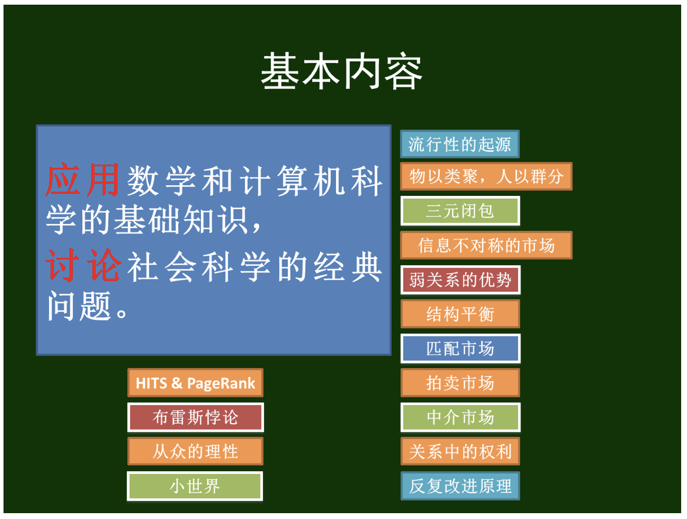

- 抽象，算法，推理
- 结构性与群体性
- 微观、个体的行为与宏观、全局效应的关系
- 自我实现的预期，均衡
- ……

### 1.2 考核方式

**平时成绩占40%**
**期末成绩占60%**

## 2. 网络和复杂系统

- **我们每时每刻都被复杂系统包围：**
  - **社会体系**是一个包含六十亿个个体的集合
  - **通讯体系**连接着众多电子设备
  - **信息体系**和**知识体系**相互连接
  - 数千个**基因**在我们体内无缝连接工作
- **这些系统是随机的，但又表现出一定的次序和组织特征**

- 每一个系统都可以表示成一个定义了元素之间**相互作用**的**网络**

### 2.1 网络示例

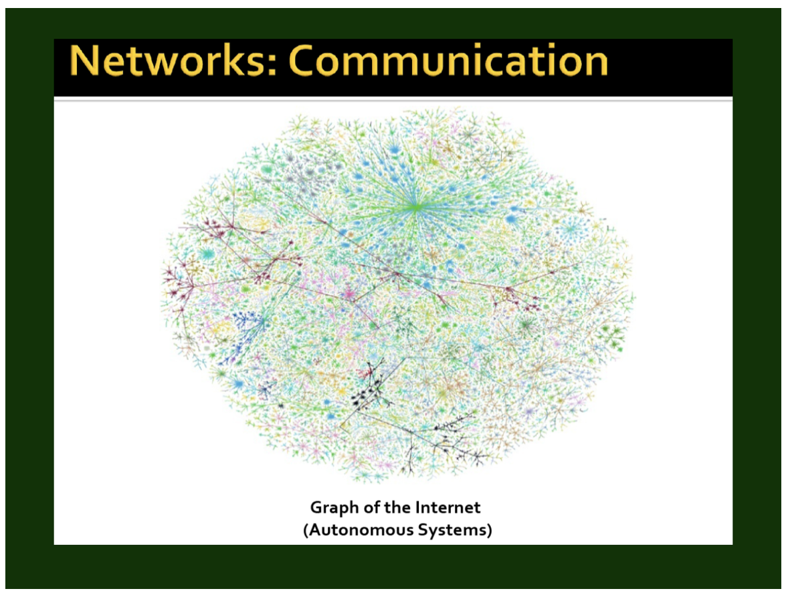
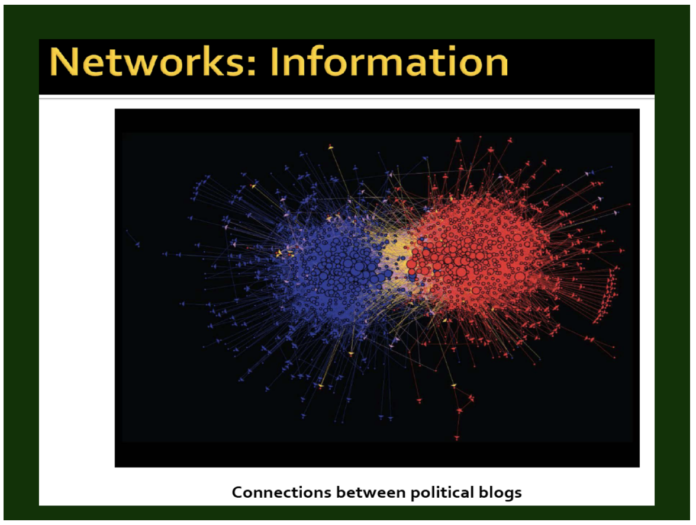
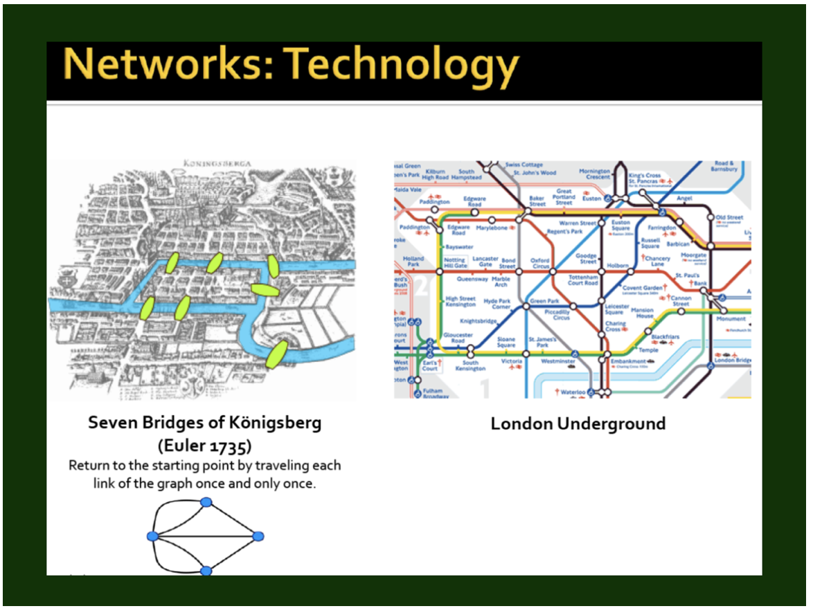
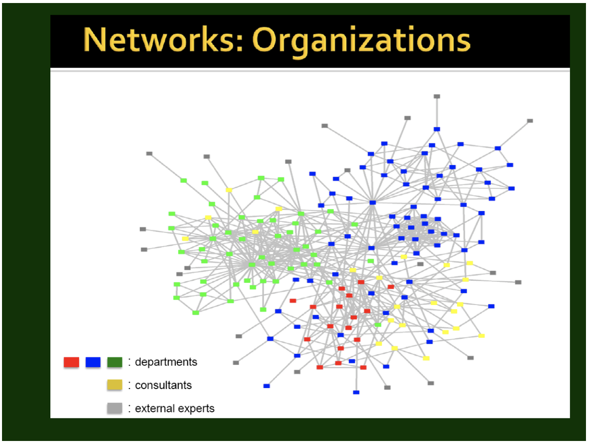
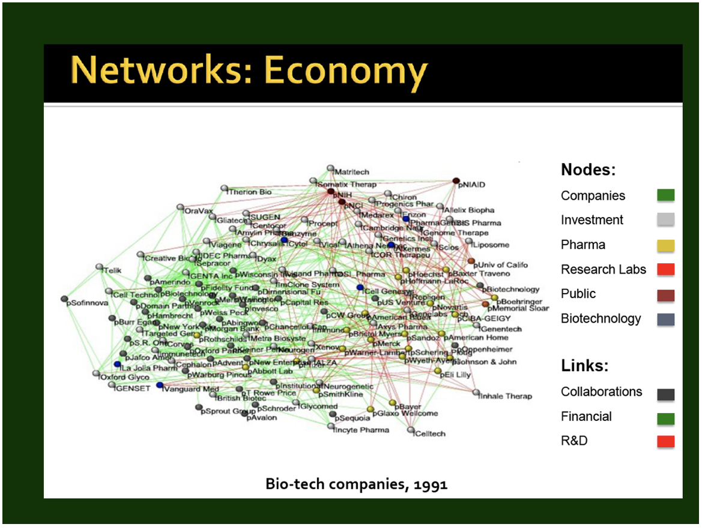
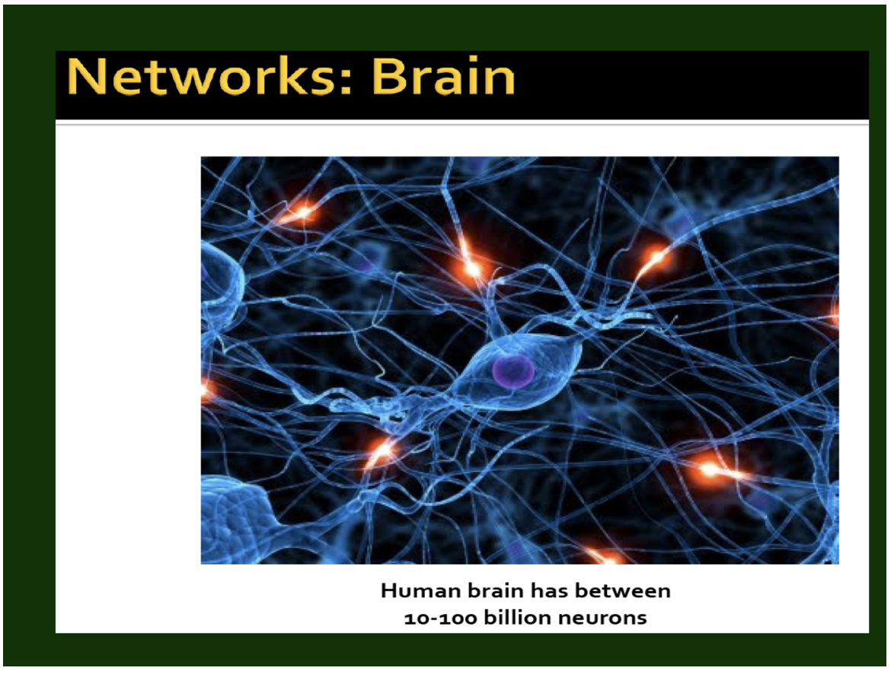
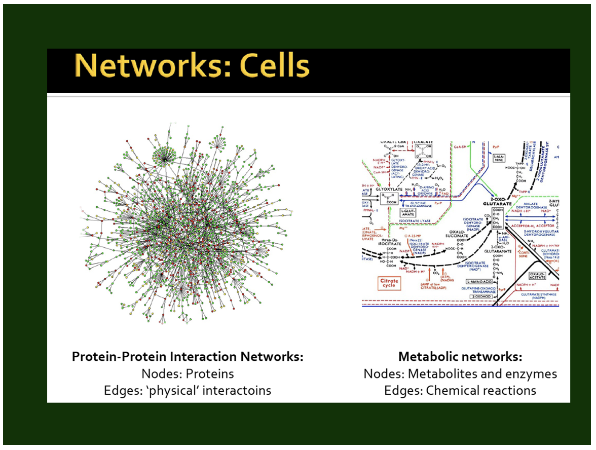

### 2.2 为什么要研究网络？

每一个系统背后都存在复杂的相互连接的图结构，**也就是一个网络**。这个网络定义了每一个元素之间的**相互作用**

> We will never understand a complex system unless we understand the networks behind it.

### 2.3 社会科学和行为科学中的社会网络分析

#### 2.3.1 企业案例

假设对一个大都市区域的企业对本地非盈利慈善组织的资助水平和类型进行研究，方式为

1. 界定一定数量的相关个体（企业）
2. 随机抽样调查
3. 测度各种特性（大小、行业、收益、支持水平等）

#### 2.3.2 陪审团案例

在陪审团进行案件审判时如何做出决定？

#### 2.3.3 资助案例

国家自然基金委员会如何做出资助决定？

#### 2.3.4 存在的问题

**问题**：某一个个体的行为会影响其他个体，这也是社会科学方法的局限性
研究时应当把**公司**当作**公司关系**来分析，也就是把**社会科学观点**当作**网络观点**来分析——成员之间如何相互影响

#### 2.3.5 综合分析

对社会实体之间的**关系**以及对这些**关系的模式和含义**的社会网络分析，**以网络观点**来解答标准的社会和行为科学研究问题。关系和关系模式的关键在于需要一组与传统统计学和数据分析方法截然不同的方法和分析概念——**网络观点：研究关系结构的模式，而不涉及个体属性**

例如：

1. 通过研究国家间的贸易模式来了解世界经济系统是否出现了核心-边缘结构
2. 通过研究中学生之间的友谊来了解友谊的模式能否被描述成相对排外的派系系统

这些分析关注于网络整体的特征，必须使用社会网络观点来研究

**网络分析框架中的联系**：血缘关系、物流、资源的流动、行为的交互作用、群体里的共同成员对某人的评价……
**关系的评价指标**：关系的存在性、关系的正负、关系的强弱

### 2.4 网络分析的基本概念

- **行动者**：彼此联系的社会实体。包括团体中的个人、企业的部门、世界体系中的国家。
- **关系连接**：行动者之间的连接
  - 他人对某人的评价（喜爱，尊重）
  - 物质资源的传输（商业交易，租借东西）
  - 联合和从属（共同参加一项社会事件，同属于一个社会团体）
  - 行为互动（一起说话，发信息）
  - 地位或状态之间的移动（移民，社会或物理的流动）
  - 自然连接（连接两点的一条公路、河流或桥）
  - 正式关系（权利）
  - 生物关系（血缘关系或血统）
- **二元图**：最基础的层次，一个连接或关系建立了两个行动者之间的联系
- **三元图**：三元关系中两个元素不仅通过直线————最短的————还有虚线彼此相连的事实，从形式社会学观点来看可以说是一个**巨大的飞跃**
  - **传递性**：行动者a喜欢行动者b，行动者b喜欢行动者c，则行动者a也喜欢行动者c
  - **平衡性**：行动者a和b相互喜欢，则a和b对第三个行动者c的态度相似。如果a和b彼此不喜欢，则他们对c的态度不同
- **子群**：任意子集的行动者和他们之间的所有联系。在社会网络分析中，用某种标准识别和研究子群是备受关系的一个问题
- **群**：相互间的联系将被测量的所有行动者的集合
- **关系**：群体成员间某种类型的联系的集合称为关系。对任何行动者群，可能会测度几种不同的关系
- **社会网络**：社会网络由一个或多个行动者有限集和他们之间的一种或多种关系组成

### 2.5 社会网络数据：收集与应用

#### 2.5.1 数据收集的属性

- **结构变量**：对成对的行动者测量得来的，表示两个行动者之间某种特定的关系
  - 公司间的商业事物
  - 人与人之间的友谊
  - 国家间的贸易
- **成分变量**：测量的是行动者的属性
  - 人的性别、种族、民族
  - 公司的地理位置、税后利润、员工数量

#### 2.5.2 如何定义数据收集的边界

- **现实主义途径**：行动者自己意识到的行动者边界和成员范围：黑帮成员
- **名义主义方法**：基于研究者的理论关注：专家研究领域

#### 2.5.3 社会网络数据示例

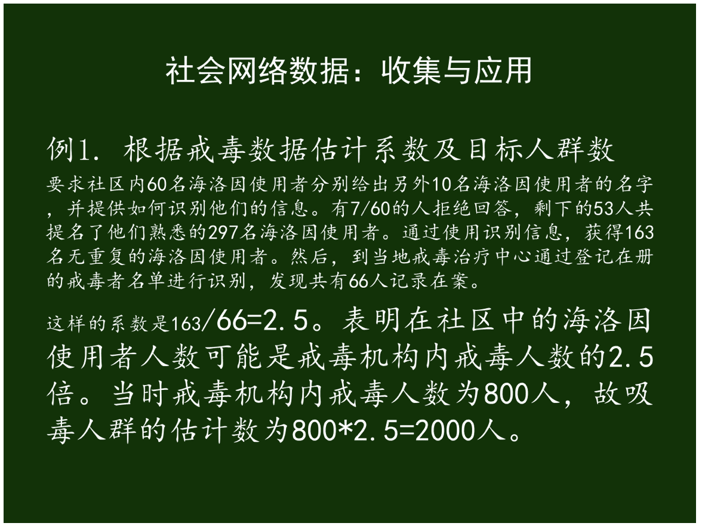
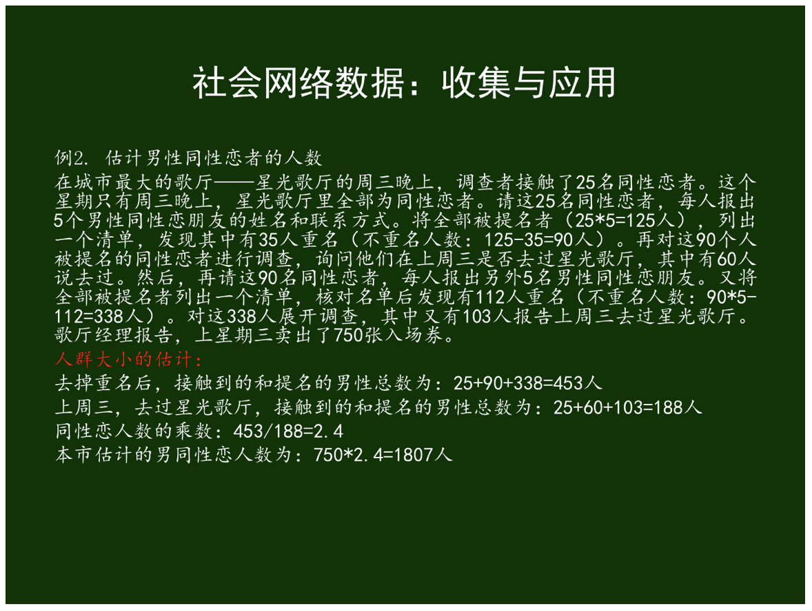

## 3. 社会网络的结构与关系强度及其在OSN上的体现

- 社会网络，不仅是人类的社会属性
  - 社会网络结构为什么会变化？
  - 社会网络结构有什么特性？
  - 结构中是否可能隐含社会性含义？

### 3.1 社会网络研究的经典

#### 3.1.1 空手道俱乐部

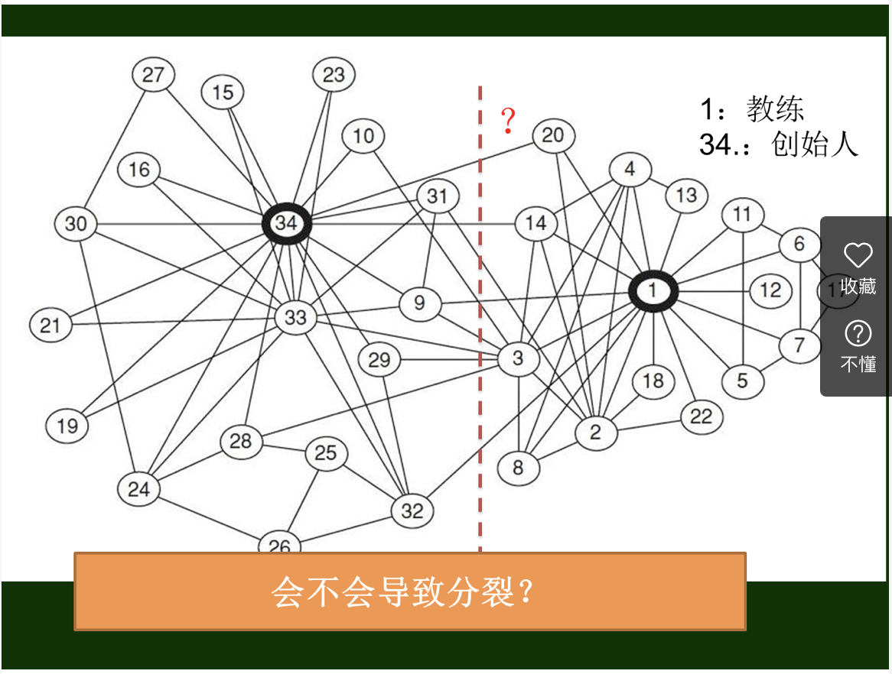

#### 3.1.2 文献引用关系

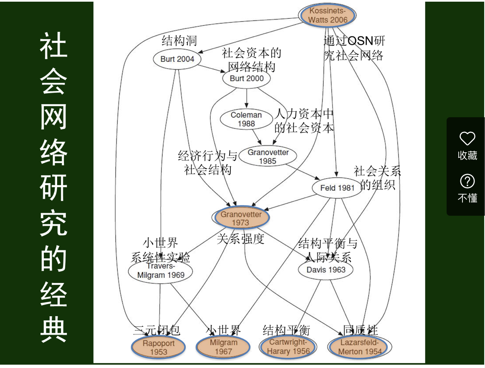

### 3.2 社会网络研究的经典文献

- 三元闭包——Rapoport 1953
- 同质性——Lazarsfeld-Merton 1954
- 结构均衡——Cartwright and Harary 1956
- 小世界——Milgram 1967
- 网络结构形态——Travers-Milgram 1969; White 1970; Wasserman 1994
- 网络结构性质——Granovetter 1973; Burt 1992
- 网络结构层级——White et al. 1976; Burt 1992
- 网络结构动态——Davis 1967; Granovetter 1985
- 结构导致后果——Coleman 1988; Lin 2002; 边燕杰 2012

### 3.3 讨论社会网络的一个视角

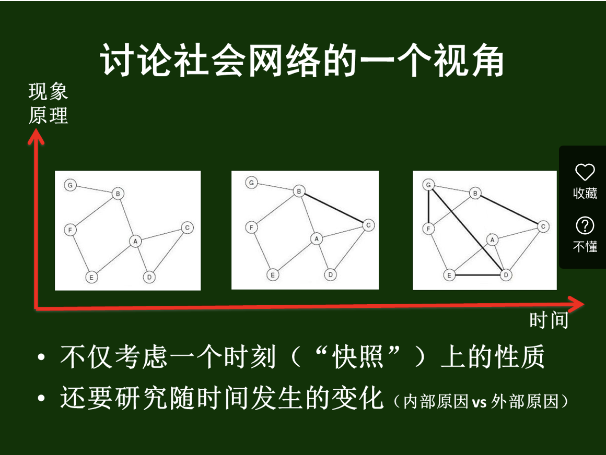

### 3.4 三元闭包（闭合）

- 这是社会网络演化的基本结构性原因
  - 如果两个互不相识的人有了一个共同的朋友，则他们俩将来成为朋友的可能性提高。

  <image src="Pics/SNA/14.png" width="70%">

- 两个人的共同朋友越多，则他们成为朋友的可能性越高
  - 量的角度
- 两个人与共同朋友的关系越密切，则他们成为朋友的可能性越高
  - 质的角度

#### 3.4.1 三元闭包示例

- 将电子邮件网络近似于社会网络
  - **节点**：一定范围的邮件地址（一个大学）
  - **边**：一段时间（两个月）里有双向邮件通信

  <image src="Pics/SNA/15.png" width="70%">

- 电子邮件网络上三元闭包迹象明显——共同朋友有助于关系的建立
- 突出体现在1-2个共同朋友情形

#### 3.4.2 节点聚集系数

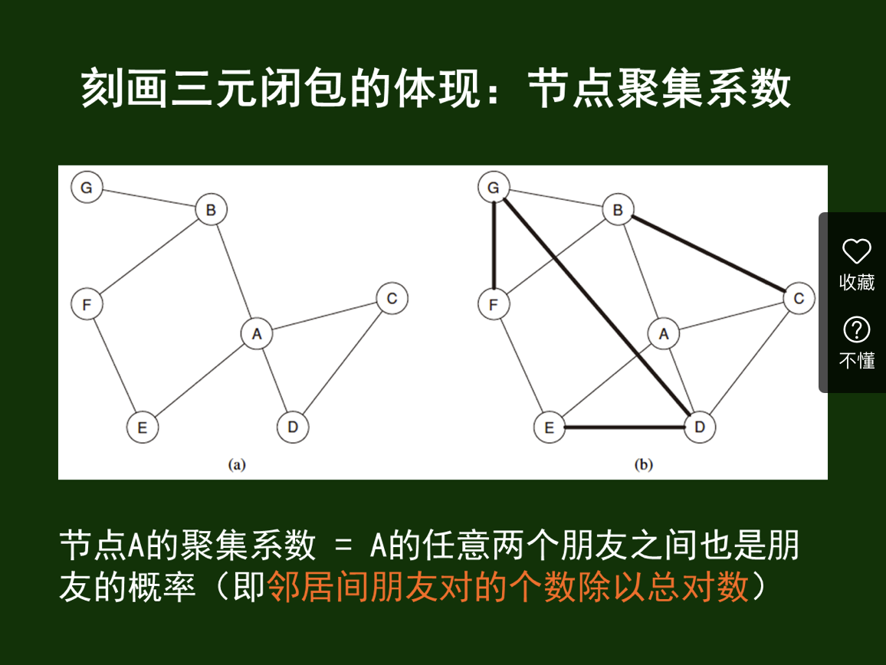

#### 3.4.3 弱关系 & 强关系

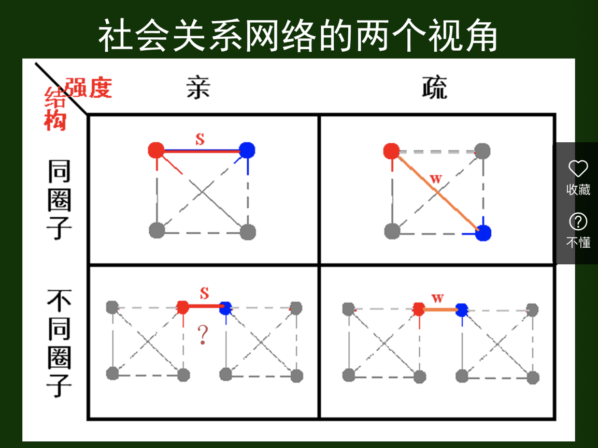

- 强三元闭包原理（假设）
  - 如果A-B和A-C之间的关系为强关系，则B-C之间形成边的可能性很高
 

- 若A有两个强关系邻居B和C，但B-C之间没有任何关系，则称A违背了强三元闭包原理
- 若A符合强三元闭包，且至少有两个强关系邻居，则与A相连的任何捷径必定意味着是弱关系
  - 捷径：两个节点没有共同节点，但是存在一条直接联系的边
  - 在一定条件下，捷径 = 弱关系
 

- 两人关系的强度如何与是否有共同朋友相关但是不等价
- 共同朋友越多，关系强度越高

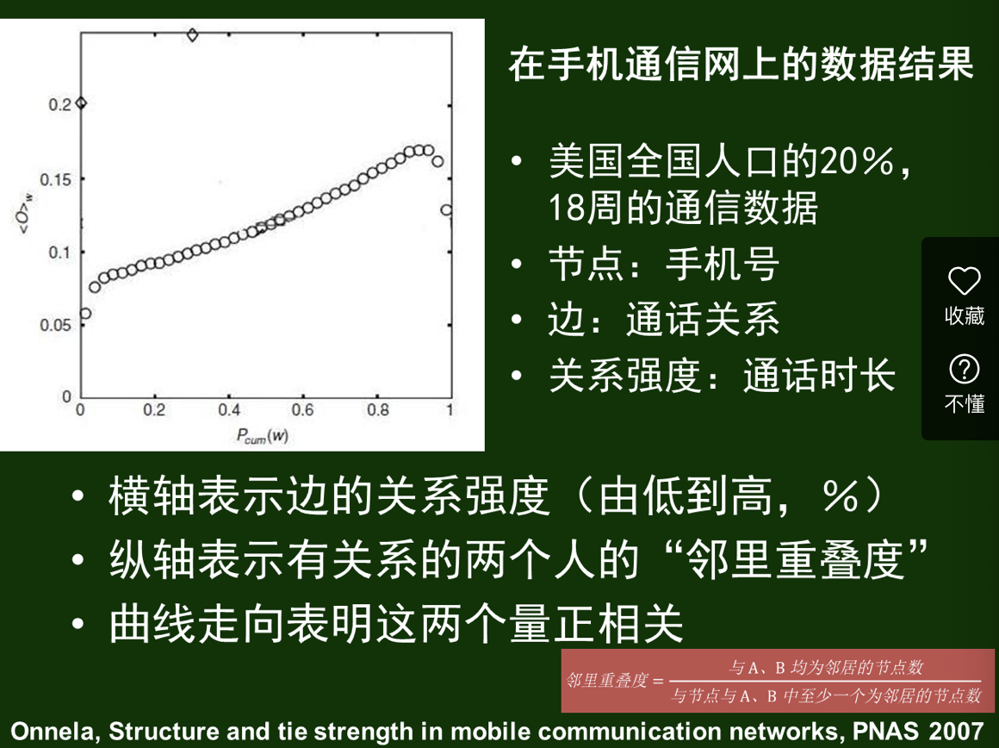

#### 3.4.4 社会网络结构的基本意象

- 用桥（或捷径，或邻里重叠度很低的边，**弱关系**）连接起来的相对比较密集互连的节点群
- 其中，那些是多个桥的端点的节点（B）值得特别讨论
  - 聚集系数低

  <image src="Pics/SNA/19.png" width="70%">

### 3.5 社会网络结构与关系强度总结

- 社会学家：关心社会网络的角度与几个经典成果（三元闭包，关系强度，结构洞）
  - 结构的重要性，网络演化的结构性因素
  - 结构的社会意义
- 计算机科学家：研究社会网络的角度与基本方法（利用获得OSN数据的可能性）
  - 考察社会网络研究的经典结果
  - 发现社会学意义的新性质

## 4. 同质性：影响社会网络结构的外部因素

- 每个人的特质可以分为两种：
  - 固有特质：性别、种族、母语等自然属性
  - 可变特质：居住区、专长、偏好等建构属性
- 同质性是社会网络结构形成的基本外部原因
- 社会学的基本问题之一：因为相似，最后才变成朋友（selection）；还是因为成为朋友而变得相似（influence）

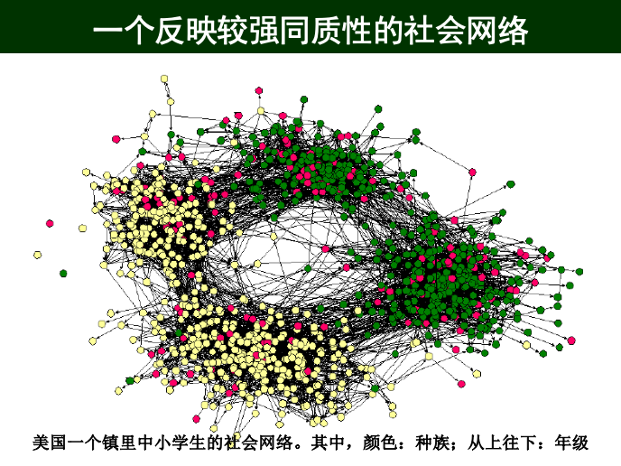

### 4.1 如何刻画社会网络中同质性表现的程度

#### 4.1.1 同质性判别基准（两种节点类型）

- 设橙色节点占比为$p$，白色为$q=1-p$
- 若他们独立随机分布在网络中，对任意一条边来说，两端点颜色不同的可能只有四种：

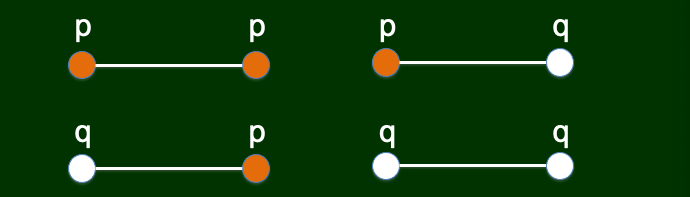

- 均匀情况下：两端点颜色不同的边占比为$2pq$——判别基准

#### 4.1.2 同质性判别过程

- 根据节点总数和不同颜色节点数，算出$p$，$q$和$2pq$
- 数出两端点不同颜色的边数，比上边的总数，记作$r$
- 若$r$明显小于$2pq$，则说明网络$G$中的同质性比较明显

### 4.2 如何研究同质性对社会网络演化的影响

#### 4.2.1 同质性影响的规律表现

- 相同兴趣，共同参与某种活动，增加建立关系的可能性；共同参与的活动数量也呈正相关

#### 4.2.2 归属网络

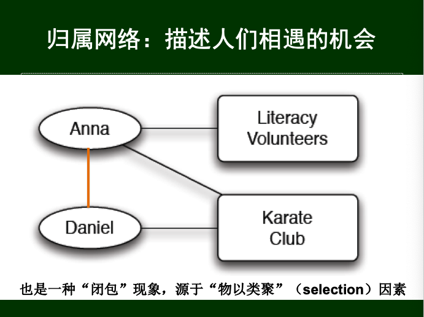

- 社交关系也可能促进人们参与原先不参与的活动

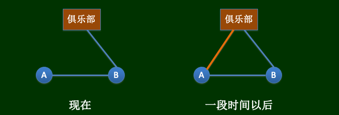

- 我们又看到了一种“闭包”行为，源于人们的相互影响
- 在社会归属网络中，三元闭包、社团闭包、会员闭包可以同时显现

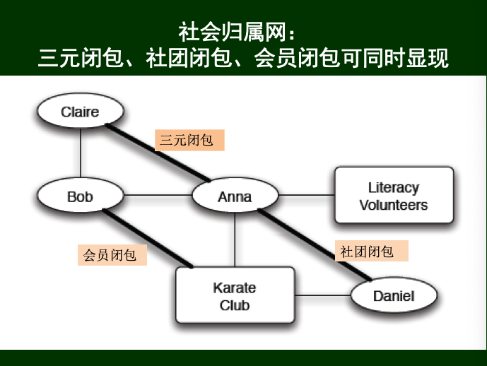

- 而社团闭包可以验证基于共同兴趣而建立联系的概率
- 会员闭包现象往往存在于人和社团中国呢，通过已有的好友关系来增强社群联系

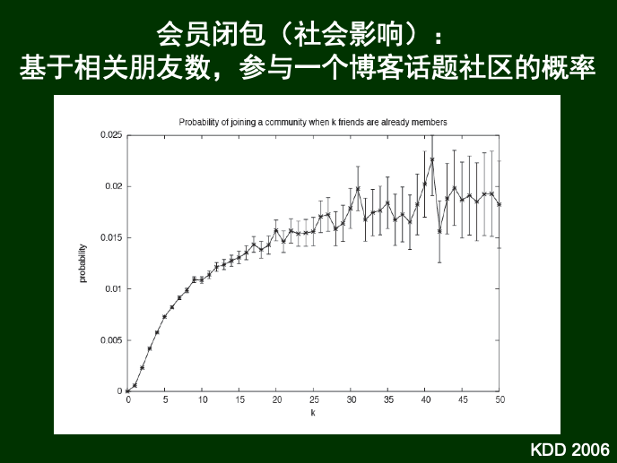

### 4.3 如何通过社会网络及其环境的研究体会朋友间相似性的成因

#### 4.3.1 选择 or 影响？

- 回到这个问题：当看到两个关系不错的人在某种特质上相似，是“相似->朋友”还是“朋友->相似”呢
- 通过考察两种力量的分别作用可以得出结论：往往是**先通过选择建立联系，后通过联系强化特征**

#### 4.3.2 谢林模型

- 解释隔离现象并不一定是个人可以选择的结果（宏观的结果并非微观影响产生）

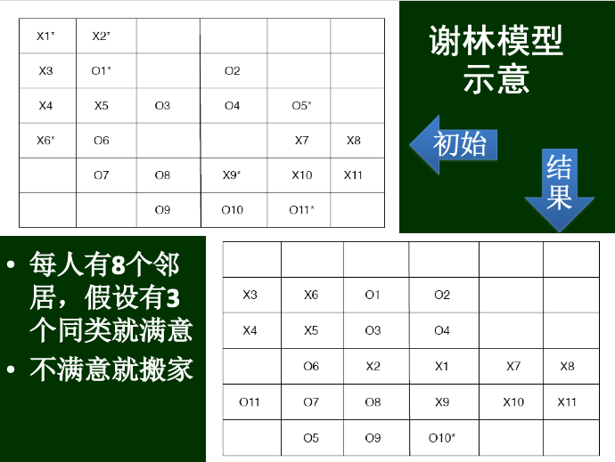
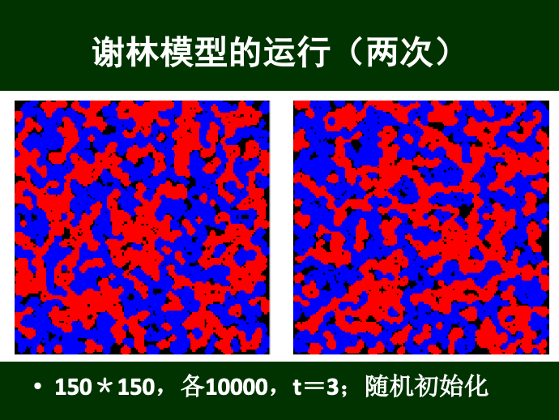
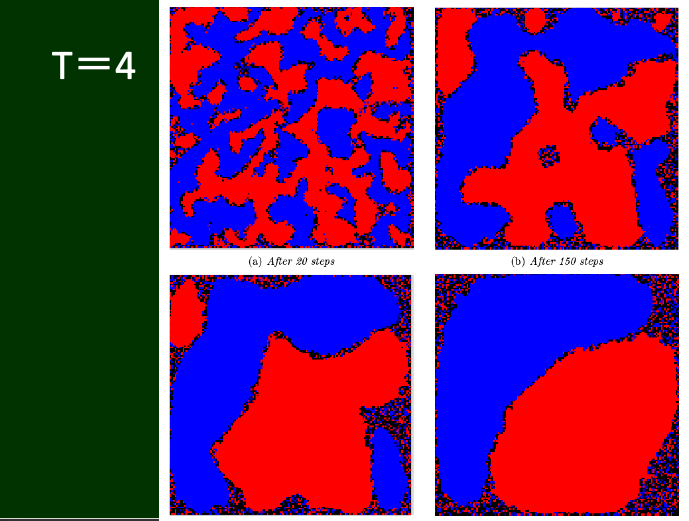

## 5. 社会网络中关系的正负及其平衡

### 5.1 边的正负性

- 社会网络中，两个节点之间的关系可能携带着各种各样的社会性含义
- 除了强弱之外，还有支持（+）与反对（-），朋友和敌人等利害关系

#### 5.1.1 三角关系中的结构平衡问题

- 从社会心理学角度看，一个平衡的三角关系要么（+++），要么（--+）。否则结构不平衡，即隐含有一种改变的力量（趋势）

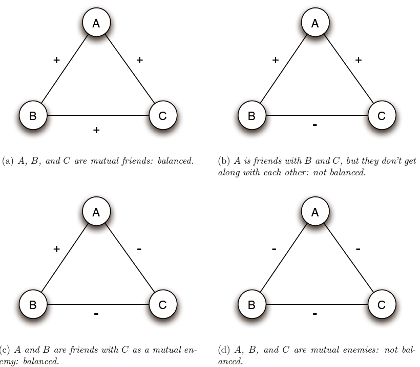

所以我们可以推出：如果一个完全图中所有的三角关系都是平衡的，那么这个图结构就是平衡的

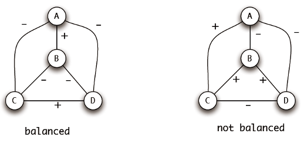

#### 5.1.2 几个例子

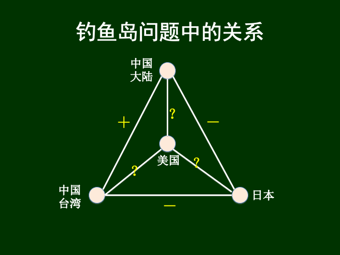
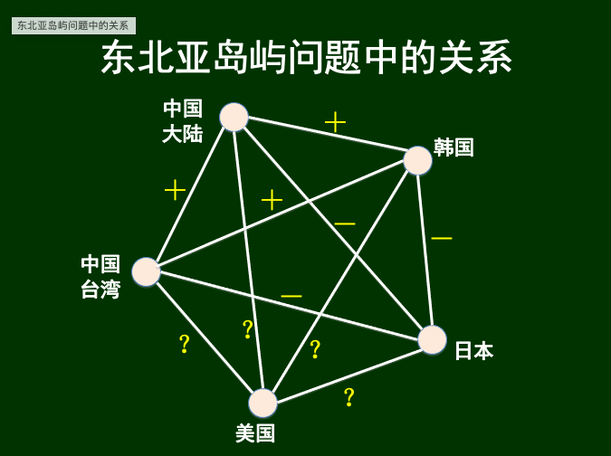

### 5.2 平衡定理

如果一个标记（+-）的完全图是平衡的，则要么他的所有节点两两都是朋友，要么他的节点可以被分为两组，X和Y，其中X组内的节点两两都是+关系，Y组内的节点两两也都是+关系，而X组中的每个节点与Y组中每个节点之间都是-关系

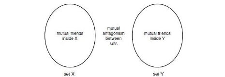

#### 5.2.1 弱平衡网络

- 注意到在平衡网络中排除的两种三角关系在社会关系的分量上是有区别的
  - 改变（---）的动力弱一些
  - 改变（++-）的动力强一些
- 弱平衡网络：**标记的完全图不存在（++-）三角关系的网络**

#### 5.2.2 平衡定理的推广

- 非完全网络中如何达到结构平衡——允许有些边的缺失
  - 表示相应两个节点之间关系不存在或不清楚
- 此时结构平衡的定义
  - 可以通过补充缺失的边，成一个平衡网络
  - 节点可以分成两组，组内边为+，组间边为-

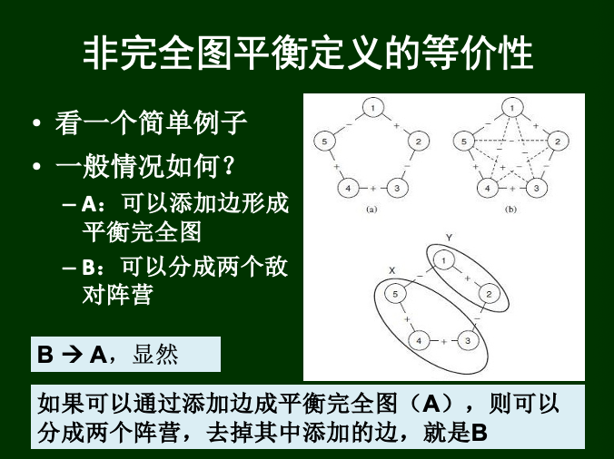

- 除此之外，还可以这样判断：如果存在一个含有奇数个负边的圈，就没有可能将其节点安排到两个敌对阵营
  - 从任何一个节点出发，遇到+必须保持阵营，遇到-必须切换阵营，回到出发点时是否矛盾

## 6. 博弈论

### 6.1 什么是博弈？

- 假设在截止日期前一天，你有两件要做的事情：一是复习考试，二是准备报告。只能做其中一项
- 考试成绩可以预计
  - 如果复习，考试成绩是92分，没复习，则是80分
- 报告需要你和你的搭档合作完成
  - 如果你和搭档都准备报告，则每个人都是100分
  - 如果只有一个人准备报告，每个人都是92分
  - 如果两人都不准备报告，每人都是84分
- 假设你们都追求平均成绩最大化
  - 你和搭档都准备报告，平均成绩为$\frac{80+100}{2}=90$
  - 你和搭档都准备考试，平均成绩为$\frac{92+84}{2}=88$
  - 一方准备考试，另一方准备报告
    - 准备报告的为$\frac{80+92}{2}=86$
    - 准备考试的为$\frac{92+92}{2}=92$
- 以上收益可以表示为矩阵
$$
\begin{array}{|c|c|c|}
\hline &B准备报告&B准备考试\\
\hline A准备报告&90，90&86，92\\
\hline A复习考试&92,86&88,88\\
\hline
\end{array}
$$

#### 6.1.1 博弈的基本要素

- 一般情况下博弈需要具有三个要素：
  - 参与者
  - 策略集
  - 收益
- 博弈行为推理的几点基本假设
  - 每个参与人对博弈结构有充分了解
  - 参与人都是理性的
    - 追求自己的收益最大化
    - 知道其他人也是如此
- 决策的独立性

#### 6.1.2 占优策略 & 严格占优策略

- 占优策略：该策略对于另一参与人的每一个策略都是最佳应对
- 严格占优策略：对一个参与人A来说，若存在一个策略，无论另一个人B选择何种行为策略，该策略都是最佳选择，则这个策略就称为是A的严格占优策略。并且按照博弈的假设，参与人都将选择严格占优策略

#### 6.1.3 最佳应对 & 严格最佳应对

- 最佳应对：针对参与人B的策略T，若参与人A采用策略S产生的收益大于或等于自己的任何其他策略，则称参与人A的策略S是参与人B的策略T的最佳应对
$$P_1(S,T)\ge P_1(S^{'},T)$$
- 严格最佳应对：若S会产生比任何应对策略T的其他策略都更高的收益，则称参与人A的策略S是对于参与人B的策略T的严格最佳应对
$$P_1(S,T)>P_1(S^{'},T)$$

### 6.2 几种经典的博弈

#### 6.2.1 囚徒困境

- 假设有两个疑犯被警察抓住。并且被分开关押在不同的囚室。警察强烈怀疑他们和一场抢劫案有关。但是，没有充足的证据。然而，他们都拘捕的事实也是可判刑的。
- 两个疑犯被告知以下结果：
  - 如果你坦白，而另外一人抵赖，则你马上释放；另外一个人将承担全部罪行，被判刑10年
  - 如果你们都坦白，你们的罪行将被证实。但由于你们有认罪的表现——判刑4年
  - 如果你们都不坦白，那么没有证据证明你们的抢劫案，我们将以拘捕罪控告你们——判刑一年

从条件中可以推断出囚徒困境的收益矩阵：
$$
\begin{array}{|c|c|c|}
\hline &B抵赖&B坦白\\
\hline A抵赖&-1，-1&-10，0\\
\hline A坦白&0，-10&-4，-4\\
\hline
\end{array}
$$

- 疑犯A和B的严格占优策略都是坦白
- 尽管两人如果都抵赖会判的更少些
  - 刻画了“有关个体私利前，建立合作是十分困难的”模型

#### 6.2.2 营销战略博弈

- 但是并不是每个人总有严格占优策略
- 假设有两家公司，分别要规划生产并销售同一种新产品。该产品有两款可能的规格：廉价或高档
- 设顾客总体被分成两个市场：一部分消费群体（60%）只消费廉价商品，另一部分消费群体（40%）只消费高档商品
- 假设每家公司从廉价或高档商品所得利润是相同的，因此利润仅取决于市场占有率，而且每家公司都追求利益最大化
- 我们刻画矩阵如下：
$$
\begin{array}{|c|c|c|}
\hline &B廉价&B高档\\
\hline A廉价&0.48，0.12&0.6，0.4\\
\hline A高档&0.4，0.6&0.32，0.08\\
\hline
\end{array}
$$

- 我们可以得知：公司A有严格占优策略，但是公司B没有。所以公司B会针对公司A的占优策略制定自己的最佳应对，可以预测此博弈的结果是公司A采取廉价策略，公司B采取高档策略

### 6.3 纳什均衡

#### 6.3.1 什么是纳什均衡

- 假定参与人A选择策略S，参与人B选择策略T。若S是T的最佳应对，且T也是S的最佳应对，则称策略组（S，T）是一个纳什均衡
  - 在均衡状态，任何参与人都没有动机去换一种策略
- **纳什均衡**：互为最佳应对的策略组，谁也不可能通过单方面改变策略而得到额外好处，尽管如果两个人都改变可能会更好（相比都不改变而言）

#### 6.3.2 三客户博弈

通过上述案例可以推测出：

- 如果两个人都有严格占优策略，则可以预计他们均会采取严格占优策略；
- 如果只有一个人有严格占优策略，则这个人会采取严格占优策略，而另一方会采取此策略的最佳应对

但是如果两个人都没有严格占优策略呢？

- 假设有两家公司，都希望和和A、B、C三个大客户之一洽谈生意。每家公司都有三种可能的策略：是否找客户A、B或C
- 他们的决策考虑如下：
  - 若两家公司都找同一个客户，则该客户会给每个公司一半的业务
  - 公司1规模太小，以至于不能靠自身找到客户源。所以，只要它和公司2分别寻找不同的客户洽谈生意，则公司1获得的收益将会是0（生意做不成）
  - 假设公司2单独寻找客户B或C洽谈生意，则会得到客户B或C的全部业务。但是A 是一个大客户。寻找客户A洽谈生意时，必须和公司1合作才能接下业务
  - 因为A是一个大客户，和它做生意的收益是8（假设两家公司合作，则每家公司会得到收益4）。但是，和B或C做生意的收益价值是2（合作的话，每个公司收益是1）
- 他们的收益矩阵为：
$$
\begin{array}{|c|c|c|c|}
\hline &B-A&B-B&B-C\\
\hline A-A&4,4&0,2&0,2\\
\hline A-B&0,0&1,1&0,2\\
\hline A-C&0,0&0,2&1,1\\
\hline
\end{array}
$$

- 两家公司都没有严格占优策略，但是存在纳什均衡：（A，A）
- 寻找纳什均衡的两种途径：
  - 检查每一个策略组，看它们中的每一项是否是彼此间策略的最佳应对策略
  - 找出每个参与人对于对方每个策略的最佳应对，然后发现互为最佳应对的策略组

### 6.4 多重均衡

- 多重均衡——存在多个均衡
- 例子：协调博弈
  - 假设你和你的搭档都为一个合作项目准备幻灯片简报（双方不能通过电话等方式联系商量）
  - 你必须决定是用微软的PPT或是用苹果的Keynote软件来制作你负责的半份幻灯片
  - 假设你们使用同样的软件来设计，那就比较容易合并你们的幻灯片
$$
\begin{array}{|c|c|c|}
\hline &B-PPT&B-Keynote\\
\hline A-PPT&1,1&0,0\\
\hline A-Keynote&0,0&1,1\\
\hline
\end{array}
$$

- 从中可以看出存在两个纳什均衡——正对角线
- 如果存在多个纳什均衡，如何预测协调博弈中参与人的行为？
  - 利用外部因素如社会习俗
  - 预测参与人会倾向于收益情况更好的均衡
  - 通过了解他们之间平常发生冲突时解决的惯例来预测

#### 6.4.1 猎鹿博弈

- 假设两猎人外出猎物。如果他们合作，可以猎到鹿（这可以给猎者带来最高的收益）
- 猎人如果分开单干，都可以猎到兔
- 若一方想单独猎鹿，则收益是0，另一方依然可以猎到兔
$$
\begin{array}{|c|c|c|}
\hline &B-鹿&B-兔\\
\hline A-鹿&4,4&0,3\\
\hline A-兔&3,0&3,3\\
\hline
\end{array}
$$

#### 6.4.2 鹰鸽博弈

- 假设两只动物要决定一块食物的分配
- 每只动物都可以选择争夺行为或者分享行为
  - 若两种动物都选择分享行为，它们将会均匀的分配食物，各自的收益是3
  - 若一方行为表现为争夺，另一方行为表现是分享，则争夺方会得到大多数食物，获得收益是5，分享方只能得到收益为1
  - 当两只动物都表现为争夺行为，由于在争夺中践踏了食物，则它们得到的收益将为0
$$
\begin{array}{|c|c|c|}
\hline &B-鸽&B-鹰\\
\hline A-鸽&3,3&1,5\\
\hline A-鹰&5,1&0,0\\
\hline
\end{array}
$$

### 6.5 混合策略

#### 6.5.1 零和博弈

通过上面两个例子我们可以知道：

- 如果双方都有严格占优策略，则都会采用
- 如果只有一方有严格占优策略，则可以预测另一方会采用此策略的最佳应对
- 如果不存在严格占优策略，则寻找纳什均衡
  - 存在一个纳什均衡，该均衡对应合理结果
  - 存在多个纳什均衡，需要额外信息辅助推断
    - 协调博弈、鹰鸽博弈
  - 均衡有助于缩小考虑范围，但不保证有效预测

但是如果不存在纳什均衡，该怎么办？

- 甲乙各持有一枚硬币，同时选择手中硬币的正反面
- 若他们硬币的朝向相同，乙将赢得甲的硬币。反之，甲将赢得乙的硬币
- 此时不存在一组互为最佳应对策略
$$
\begin{array}{|c|c|c|}
\hline &B-H&B-T\\
\hline A-H&-1,+1&+1,-1\\
\hline A-T&+1,-1&-1,+1\\
\hline
\end{array}
$$

- 此时，如果这样的博弈重复进行若干次，你会如何考虑自己的博弈？
- 预测对方采用不同策略的概率，据此确定自己的策略
- 不要让对方了解自己采用不同策略的概率
- **此时，你的策略可以看成是在两种固定策略（纯策略）之间选择的概率**

#### 6.5.2 什么是混合策略

- 混合策略的引入
  - 引入随机性，考虑参与人将以一定的概率分布在不同策略间进行选择，一种分布对应一个“策略”（称为混合策略，此时，选择策略就是选择分布）
    - 对于双策略（H和T）博弈，混合策略则可简略表示为一个概率
  - 通常，我们说
    - 参与人1的策略是概率 p，是指他以概率 p执行H；以概率 1-p 执行T
    - 参与人2的策略是概率 q，是指他以概率 q执行H，以概率 1-q 执行T
- 混合策略下博弈的三要素
  - 参与人
  - 策略
  - 收益：此时的策略是在两种固定（纯）策略上选择的概率，每一组纯策略是对应有固定收益的。因而，从概率意义出发，此时的收益应该体现一种在两种纯策略上的“平均”（期望）
- 但是，在研究一个混合策略博弈的时候，我们一般并不关心在每个策略下的具体回报情况，而是关心是否能达到均衡？在什么混合策略组下达到均衡？哪两个概率是互为最佳应对？

#### 6.5.3 混合策略的均衡：互为最佳应对

- 在各自概率策略的选择下，双方的收益期望互为最大（任何单方面改变不会增加其收益）
- 纳什的奠基性贡献：证明了具有有限参与者和有限纯策略集的博弈一定存在纳什均衡（包括混合策略均衡）
- 一般来说，找到混合策略的纳什均衡是很困难的，但在某些特定条件下能有系统的方法
- 在这一例子中：
$$
\begin{array}{|c|c|c|}
\hline &B-H&B-T\\
\hline A-H&-1,+1&+1,-1\\
\hline A-T&+1,-1&-1,+1\\
\hline
\end{array}
$$

- **通过计算我们可以得出，当我们选择在p=q=0.5时，对方出什么，对于奔放来说都无所谓，即我的任何策略都是他的最佳应对**

#### 6.5.4 无差异原理

- 一对混合策略互为最佳应对的必要条件是它们分别使得对方在两个纯策略选择上得到的回报无差异
- 这就是我们借以求解混合策略均衡的原理——**无差异原理**
- 做法思路是：设一方的混合策略概率为p，写出另一方在两个纯策略上分别的收益期望，令它们相等，方程的解即为均衡策略
  - 好的概率策略就是使对方不知道用哪个纯策略更好的策略
- 我们可以计算混合策略的收益
  - 设参与人1采用概率p执行H，1-p执行T，则：
  - 若参与人2采用H，则他的收益期望是：
    - $P_2(p,H)=p\cdot P_2(H,H)+(1-p)\cdot P_2(T,H)$
  - 若参与人2采用T，则他的收益期望是：
    - $P_2(p,T)=p\cdot P_2(H,T)+(1-p)\cdot P_2(T,T)$
  - 这是两个关于p的线性表达式，令它们相等，若唯一解存在且在（0，1）中，则求得了参与人1的均衡策略p

## 7. 进化博弈论基本概念简介

### 7.1 进化博弈的由来

- 进化论的主要观点
  - 生物体的遗传基因在很大程度上决定了他的外部特征，因而决定了它是否能够适应给定的环境
  - 生物体对环境适应性的基本表征是其繁衍能力，较强的生物体往往会繁衍较多的后代，于是该物种在生物总体中的占比增加
  - 一个物种的成功进化取决于他其中的个体和其他个体的互动结果
- 1960s，从博弈论视角来解释生物进化论
  - 由基因决定的生物特征及行为可类比为博弈中的策略
  - 将生物的适应性的提高类比为他的收益
- J.M.Smith和G.R.Price，提出“进化稳定”的概念，标志着进化博弈论的诞生

### 7.2 甲虫适应性和变异

#### 7.2.1 任务描述

- 考虑一种甲虫群体
- 假设每只甲虫对给定的环境的适应能力取决于
  - 他是否可以发现食物
  - 从获得的食物中有多少能转换成为生物适应性
- 设想一个特定的突变基因出现，使得该基因的甲虫体型变大
- 因此，甲虫便分成两个不同的种群——小甲虫和大甲虫
- 我们假设两只甲虫为食物争夺时，可能有
  - 如果他们大小相同，他们会平分同样的食物
  - 当一只大甲虫和一只小甲虫争夺食物，则大甲虫会得到大多数的食物
- 对于同样的食物量，大甲虫在适应性上得到的益处要少，因为所得到的食物中有一部分要转化用来维持他们小号较高的新陈代谢

#### 7.2.2 收益矩阵

- 每只甲虫从争夺到的一定量食物中获得的生物适应性，可以看作是双人博弈中的收益
- 随即碰到的一只甲虫有两种可能：大或小。则有
$$
\begin{array}{|c|c|c|}
\hline &小&大\\
\hline 小&5,5&1,8\\
\hline 大&8,1&3,3\\
\hline
\end{array}
$$

#### 7.2.3 进化稳定策略

- 一个策略称为是进化稳定的，若当整个群体都采取这个策略时，其他采用不同策略的小规模“入侵”群体经过多代遗传后最终会消亡
- 形式化定义：
  - 一种生物体的适应性是指它与一个随机遇到的生物体互动得到的收益期望
  - 称“策略T在x程度上入侵策略S”，指的是在总体中有x占比的生物体采用策略T，1-x占比采用策略S
  - 若存在一个小正数y，当任何其他策略T以任何x<y水平入侵策略S时，采用策略S的个体的适应性严格高于采取策略T的个体，则称策略S是进化稳定的

#### 7.2.4 考察甲虫是否符合进化稳定策略

**对于小体态**：
$$
\begin{array}{|c|c|c|}
\hline &小\ 1-x&大\ x\\
\hline 小&5,5&1,8\\
\hline 大&8,1&3,3\\
\hline
\end{array}
$$

- 一只小甲虫的收益期望是$5(1-x)+1x=5-4x$
- 一只大甲虫的收益期望是$5(1-x)+3x=8-5x$
- 可见，不存在y使得x<y时小甲虫的收益期望超过大甲虫。因此，策略“小体态”不是进化稳定的

**对于大体态**：
$$
\begin{array}{|c|c|c|}
\hline &小\ x&大\ 1-x\\
\hline 小&5,5&1,8\\
\hline 大&8,1&3,3\\
\hline
\end{array}
$$

- 一只小甲虫的收益期望是$3(1-x)+8x=3+5x$
- 一只大甲虫的收益期望是$(1-x)+5x=1+4x$
- 大甲虫的收益期望总是超过小甲虫的，所以“大体态”是一个进化稳定策略

### 7.3 进化博弈中的囚徒困境

- 生物学家认为在自然界中存在具有囚徒困境结构的进化博弈现象
  - 树木高矮的竞争
  - 植物根系的竞争

例如在病毒之间的进化博弈：

- 其结构为：
  - 病毒有两种：$\Phi6$和$\Phi\mathrm{H}2$
  - 在一个纯$\Phi6$种群中，病毒行为收益会优于纯$\Phi\mathrm{H}2$种群的病毒
  - 但是，当病毒$\Phi\mathrm{H}2$与$\Phi6$同时存在时，$\Phi\mathrm{H}2$的收益会比较高，甚至高于纯$\Phi6$种群的情形
  - 因此，$\Phi\mathrm{H}2$是进化稳定的
- 结果就是，一旦$\Phi6$种群中出现了少量变异$\Phi\mathrm{H}2$，则$\Phi\mathrm{H}2$病毒会越来越多，$\Phi6$越来越少
$$
\begin{array}{|c|c|c|}
\hline &\Phi6&\Phi\mathrm{H}2\\
\hline \Phi6&1.00,1.00&0.65,1.99\\
\hline \Phi\mathrm{H}2&1.99,0.65&0.83,0.83\\
\hline
\end{array}
$$

### 7.4 进化稳定策略与纳什均衡

#### 7.4.1 进化稳定策略的一般描述

考虑双人对称博弈形态：
$$
\begin{array}{|c|c|c|}
\hline &S\ (1-x)&T\ x\\
\hline S&a,a&b,c\\
\hline T&c,b&d,d\\
\hline
\end{array}
$$

- 如何用abcd写出S是进化稳定的条件？
- 设对于一个很小的正数$x<1$，总体中有1-x部分使用策略S，有x部分使用策略T
  - 采取S策略的期望收益：$a(1-x)+bx$
  - 采取T策略的期望收益：$c(1-x)+dx$
  - 应满足$a(1-x)+bx>c(1-x)+dx$
- 结论：在双人双策略的对称博弈中，若$a>c$或$a=c,b>d$，则S是进化稳定的
- 这意味着：
  - 为了使S成为一个进化稳定策略，用策略S应对策略S的回报不能小于用策略T来应对策略S取得的回报
  - 若策略S和T在应对策略S时的收益相等。为了保证S是一个进化稳定策略，采取策略S应对策略T的收益要严格大于采取策略T应对策略T的收益

#### 7.4.2 进化稳定策略与纳什均衡的关系

- 博弈 $\to$ 纳什均衡（互为最佳应对策略组）
- 进化博弈 $\to$ 进化稳定策略
- 给定一个收益矩阵，我们可以讨论是否存在纳什均衡，也可以讨论哪个策略是进化稳定的  $\to$ 基于各自的定义
$$
\begin{array}{|c|c|c|}
\hline &S&T\\
\hline S&a,a&b,c\\
\hline T&c,b&d,d\\
\hline
\end{array}
$$

- S是进化稳定的条件：
  - $a>c$或$a=c,b>d$
- （S，S）是纳什均衡的条件：$a\ge c$
- 因此，，若策略S是进化稳定的，则（S，S）一定是一个纳什均衡。反之不一定成立

#### 7.4.3 进化稳定策略和严格纳什均衡

- 在一个策略选择中，若每个参与人使用的都是唯一的最佳应对策略（即严格最佳应对），则称这个最佳应对策略组是一个严格纳什均衡
- 如果（S，S）是一个严格纳什均衡（$a>c$），则S是进化稳定的。反之不一定成立

### 7.5 进化稳定混合策略

- 一种生物个体，由其基因决定，按照概率分布（p，1-p）随即采用两个策略S和T之一
- 想象有一群这样的个体，在互动中繁衍
- 突然其中出现了一种变异：概率变为q
- 设变异种群在总体中初识占比x很小，问原来的种群是进化稳定的吗？
  - 也就是，在互动中，p种群能比q种群更具适应能力，从而能抑制q种群的蔓延吗？
- 若是，则称p是进化稳定混合策略

#### 7.5.1 收益矩阵

$$
\begin{array}{|c|c|c|}
\hline &S\ q&T\ (1-q)\\
\hline S\ p&a,a&b,c\\
\hline T\ (1-p)&c,b&d,d\\
\hline
\end{array}
$$

- $V(p,p)=p^2a+p(1-p)(b+c)+(1-p)^2d$
- $V(p,q)=pqa+p(1-q)b+(1-p)qc+(1-p)(1-q)d$
- $V(q,p)=pqa+(1-p)qb+p(1-q)c+(1-p)(1-q)d$
- $V(q,q)=q^2a+q(1-q)(b+c)+(1-q)^2d$

所以可以将收益矩阵转换为：
$$
\begin{array}{|c|c|c|}
\hline &一\ (1-x)&二\ x\\
\hline 一&V(p,p),V(p,p)&V(p,q),V(q,p)\\
\hline 二&V(q,p),V(p,q)&V(q,q),V(q,q)\\
\hline
\end{array}
$$

#### 7.5.2 收益期望

- 第一种：$E_1(x,p,q)=(1-x)V(p,p)+xV(p,q)$
- 第二种：$E_2(x,p,q)=(1-x)V(q,p)+xV(q,q)$

若 $\exist y, \forall x<y, q\ne p$，有 $E_1(x,p,q)>E_2(x,p,q)$，则说p是一个进化稳定混合策略

- 注意，优于p的进化稳定性要求x可以任意小，于是必有 $V(p,p)\ge V(q,p)$。这意味着混合策略p是自己的最佳应对，亦即（p，p）是一个混合纳什均衡
- 结论：p是进化稳定混合策略，（p，p）是混合纳什均衡

#### 7.5.3 鹰鸽博弈

$$
\begin{array}{|c|c|c|}
\hline &D\ q&H\ (1-q)\\
\hline D\ p&3,3&1,5\\
\hline H\ (1-p)&5,1&0,0\\
\hline
\end{array}
$$

- 根据无差异原则，有：3q+1-q=5q, 3p+1-p=5p
- 解得知 $(\frac{1}{3},\frac{1}{3})$ 是混合纳什均衡
- p是进化稳定混合策略的条件：对任意的q，所有小x满足：$(1-x)V(p,p)+xV(p,q)>(1-x)V(q,p)+xV(q,q)$
- 因为若p是进化稳定混合策略，则 $(p,p)$ 是混合纳什均衡，于是就要有对任意的q，$V(p,p)>V(q,p)$
- $V(p,q)-V(q,q)=(4q+\frac{1}{3}-(6q-3q^2)=\frac{1}{3}(3q-1)^2>0$
- 因此，$p=\frac{1}{3}$就是进化稳定混合策略

### 7.6 进化博弈论小结

- **进化稳定**：能够抵御一小群采用不同策略的个体的入侵，个体间的互动中能获得较高的收益期望
- **进化稳定策略**：S，在对称收益矩阵（a，b，c，d）的适当条件下，对所有 $x<y$，优于T
- **进化稳定混合策略**：在S和T中进行选择的概率，在对称收益矩阵（a，b，c，d）的条件下，对所有$x<y$，优于任何$x\ne y$

## 8. 网络流量的博弈论模型

- 布雷斯悖论——如果结构不合理，增加资源可能更糟
- 例如：
$$
A\stackrel{\frac{x}{100}}{\longrightarrow}C\stackrel{45}{\longrightarrow}B\\
A\stackrel{45}{\longrightarrow}D\stackrel{\frac{x}{100}}{\longrightarrow}B
$$
- 参与人：4000位司机
- 策略：走上面和走下面
- 回报：行驶时间（越小越好）
- 均衡：每条路上2000辆车，对于每辆车回报都是65

此时政府想要改善民生，新修了一条路，现状为：
$$
A\stackrel{\frac{x}{100}}{\longrightarrow}C\stackrel{45}{\longrightarrow}B\\
A\stackrel{45}{\longrightarrow}D\stackrel{\frac{x}{100}}{\longrightarrow}B\\
A\stackrel{\frac{x}{100}}{\longrightarrow}C\stackrel{0}{\longrightarrow}D\stackrel{\frac{x}{100}}{\longrightarrow}B
$$

- 新的均衡状态下，每人都会走ACDB，回报为80

### 8.1 均衡路线模式的存在性证明

- 均衡：在车辆群所体现的行驶路线模式中，没有司机可以通过改变线路缩短自己的通行时间，其中，一条边e上的通行时间函数为 $T_e(x)=ax+b$
- 在网络交通模式上定义一个适当的量，使得当一个司机选择缩短自己行驶时间的路线后，新模式的这个量严格减小
  - 这个量不能是所有车辆的行驶时间的和，因为一辆车的缩短了，其他的可能因此加长了，总时间的变化难以说清楚
- Potential Energy
  - 对于一条边e，$\mathrm{Energy}(e)=T_e(1)+T_e(2)+\cdots+T_e(x)$
  - 对于一个交通模式，$\sum\mathrm{Energy}(e)$
- 某一司机放弃原来的路线意味着新的路线时间减少，则原路线的势能和新路线的势能分别为：
  - $T_e(1)+\cdots+T_e(x)\longrightarrow T_e(1)+\cdots+T_e(x-1)$
  - $T_{e^{'}}(1)+\cdots+T_{e^{'}}(x-1)\longrightarrow T_{e^{'}}(1)+\cdots+T_{e^{'}}(x)$
  - $T_{e^{'}}(x)<T_e(x)$

### 8.2 均衡态社会成本上界的证明

- 均衡状态下车辆行驶时间之和（社会成本）可能不是最少（社会最优）的，但也不会太差（严格上界为$\frac{4}{3}$倍）
  - 为简单起见，这里只证明了一个弱一点的结果（2倍）
- 一辆车在边上的通行时间：$T_e(x)=a_ex+b_e$
  - 其中$e$为边的标识，$x$为该边上的车辆数
- 一条边的势能：$\mathrm{Energy}(e)=T_e(1)+T_e(2)+\cdots+T_e(x)$
- 一条边的社会成本：$\mathrm{Cost}(e)=xT_e(x)$
- 易得：
$$
\begin{align}
&\because\frac{1}{2}\mathrm{Cost}(e)\le\mathrm{Energy}(e)\le\mathrm{Cost}(e)\\
&\therefore\frac{1}{2}\mathrm{SocialCost}(Z)\le\mathrm{Energy}(Z)\le\mathrm{SocialCost}(Z)\\
&\because\mathrm{Energy}(Z^{'})\le\mathrm{Energy}(Z)\\
&\therefore\mathrm{SocialCost}(Z^{'})\le2\cdot\mathrm{Energy}(Z^{'})\le2\cdot\mathrm{Energy}(Z)\le2\cdot\mathrm{SocialCost}(Z)
\end{align}
$$

## 9. 拍卖中的博弈论思想

||拍卖方式|成交规则|支付价格|是否知道他人出价|应用场景|
|---|---|---|---|---|---|
|英式拍卖|竞买者逐步加价，直到最后只剩下一个投标人为止|出价最高者得到奖品|最高的报价|是|古董和艺术品的拍卖|
|荷兰式拍卖|出售者从一个较高价格开始逐步降价，直到有人愿意购买|出价最高者得到拍卖品|最高的出价|是|农产品的交易|
|售价密封拍卖|在某一个约定的时间同时公开所有投标人的报价|竞买最高，竞卖最低|最高或最低的报价|否|政府公共工程建设招标|
|次家密封拍卖|在某一个约定的时间同时公开所有投标人的报价|竞买最高，竞卖最低|次高或次低的报价|否|互联网门户和搜索引擎公司用于出售网页上的广告位|

- 形式化地考虑次价密封拍卖问题
  - 一件物品
  - 不同的人对它的价值有不同的认识
  - 每个人提出一个竞拍价
  - 结论是：每个人都会按照自己的估值出价最优——一个按照自己估值出价的人不可能通过改变策略得到更大的回报，无论别人出价策略如何
- 对于首价密封拍卖中，为什么按照估值报价没有这种性质？
  - 如果你的出价最高，赢得了交易，你其实有可能稍微降低一点你的出价还能够赢得交易，从而得到较大的回报
  - 因此，可以理解在首次密封拍卖中人们倾向于较低出价。对比起来，次家密封拍卖告诉人们：偏离估值出价没有意义。因此，我们可以说：“次价支付规则”鼓励真实报价。

## 10. 匹配市场

- 某一类商品，一群卖方和一群同样数量的买方
- 商品的质量不同，大家的认识也有差别
- 买方对商品各有一个底价，都追求利益最大化
- 市场按照供需关系自动调整价格，试图达成买卖双方的某种匹配
- 我们关心最终能否大家都满意
  - 卖方：市场清仓，商品在底价之上都卖出去了
  - 买方：得到差价最大的商品

  <image src="Pics/SNA/36.png" width="70%">

## 11. 中间商市场

- 交易进行的规则
  - 第一步：中间商分别给出“出价”和“要价”
  - 第二步：买卖方给出反馈（选择一个中间商）
- 条件
  - 一旦价格公布，买方与卖方双方只能选择一个中间商进行交易，或者不交易；但不能议价
  - 卖方只有一件物品，买方也只要一件物品，如果交易达成，则可以看作一件物品从卖方经中间商流到买方
  - 中间商的定价不能造成入不敷出或者囤积居奇现象

  <image src="Pics/SNA/37.png" width="70%">

## 12. 社交关系价值的均衡

### 12.1 社交网络关系的特点

- 节点：人
- 边：朋友关系、经济关系、同事关系等等
- Richard Emerson认为
  - 在社会网络上，与其讨论一个节点的权利，不如讨论在一个关系中的两个人哪一个更有权力（看待一个关系的轻重）
    - 于是，同一个节点，在不同的关系上，所表现出来的权力可能就不一样。
  - 社会交换框架的著名学者，曾任华盛顿大学社会学系系主任
- 一般来说，现实社会网络中两个人之间关系的轻重取决于多方面的因素，我们这里只考虑网络结构的影响

### 12.2 网络交换实验的一般性描述

- 通过一种由经济象征意义的操作，考察社会网络结构对权力的影响
- 选择有代表性的网络
  - 针对一个原理，一种认识等
    - 依赖性、排他性、饱和性、中心性等等
  - 同一网络，多次重复实验，得统计性结果
    - 1-交换，2-交换，等等，影响复杂
  - 如果一种实验结果一致性强，问：为什么会如此？
    - 背后当然会涉及人们的心理因素，但明显是由网络结构调动出来的心理因素

### 12.3 社交网络上的典型例子

1. 两节点简单网络，如果进行网络交换实验，能预计什么结果？——体现在关系权力上的一种完全对称性
   

   <image src="Pics/SNA/38.png" width="400">
   

2. 三节点（路径）网络，如果进行网络交换实验，能预计什么结果？——体现在关系权力上的一种极端不平衡
   

   <image src="Pics/SNA/39.png" width="400">
   

3. 四节点（路径）网络，如果进行网络交换实验，能预计什么结果？——体现在关系权力上的一种弱不平衡
   

   <image src="Pics/SNA/40.png" width="400">
   

4. 五节点（路径）网络，如果进行网络交换实验，能预计什么结果？——体现中心不一定有强权的情形
   

   <image src="Pics/SNA/41.png" width="400">
   

5. 柄图和三角图
   

   <image src="Pics/SNA/42.png" width="200">
   

### 12.4 纳什议价解

- 假设网络中两个节点的外部选项可以量化为x和y，在关系上划分的预期结果如何？
  - 规格化：$0\le x<1$，$0\le y<1$，$x+y<1$
- 纳什的理论结果：双方满意于均分$s=1-x-y$
  - 对于A：$\frac{x+s}{2}=\frac{x+1-y}{2}$
  - 对于B：$\frac{y+s}{2}=\frac{y+1-x}{2}$
- 也与人们的直觉（平分剩余）相符，于是我们可以预计实验的结果应该与他近似

### 12.5 平衡结果

- 稳定结果意味着一个外人不可能通过提供好处来破坏一个已有的价值分配关系
- 但那个分配关系本身是不是合理呢？
  - 即关系中的两个人是不是都满意？
- 前面明确了，若一个价值分配对应纳什议价解，则认为双方应该是满意的（反过来就不一定满意，即存在议价空间）
  - 但纳什议价解涉及到“外部选项”，如何得知？
- 于是，给定一个结果，我们可得到每一个节点的外部选项，进而可以根据结果中节点的赋值算的匹配中每条边上的交换是否满足纳什议价解
- 平衡结果：结果中匹配的每条边上的价值划分都满足纳什议价解

### 12.6 社会关系价值的计算：启示

- 一个人在社交网络中的位置（结构地位）影响他对各种关系价值的认识
- 可以通过一种形象化的经济行为实验，来揭示这种社交心理现象
- 进而，实验的结果可以在一定程度上被理论预测
- 这意味着：由结果地位所引起的社交心理状态可以“被算出来”

## 13. 万维网信息的结构

### 13.1 Web信息的基本结构特征

- 以网页为组成单位，每个网页对应一个网址
- 每个网页上可能有多个链接，每个链接指向另一个网页
- 由此，我们可以体会到
  - 给定网页A和B，有可能通过一个个相继的链接，经过一些中间网页，从A到达B
  - 如果可以如此从A到达B，也可以从B到达A，中间经过的网页很可能是不一样，路径的长度也就可能是不一样的
  
### 13.2 有向图：Web信息结构的模型

- 节点：网页
- 有向边：表示从一个节点到另一个节点的直接链接关系；节点的出向边与入向边
- 有向节点：两节点之间边的方向一致的路径
  - 节点A到B的距离：从A到B最短有向路径的长度
  - 注意，从A到B的距离不一定等于从B到A的距离
- 强连通有向图：任何两节点之间都存在两个方向的有向路径
- 强连通分量：尽可能大的节点子集，其中每个节点都有到其中任何另一节点的有向路径

### 13.3 “领结”：Web信息结构的一种概貌

- 1999，Andrei Broder等发现万维网包含一个超大强连通分量SCC，加上其他部分，显示出一种形象的结构
  - 链入，链出，卷须（管道），游离

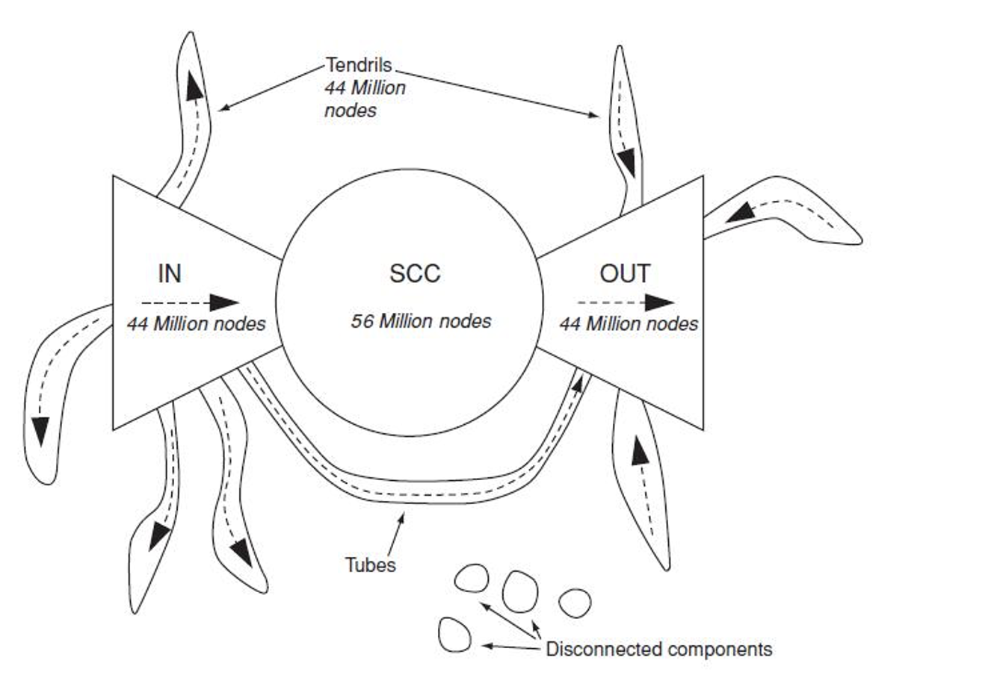

### 13.4 计算领结结构的方法（算法）

- 输入：有向图G
- 第一步：生成图G的反向图G'
- 第二步：选择一个在最大强连通子图中的节点A
- 第三步：以A为出发节点，在图G中宽度优先搜索直到没有新的节点发现，得节点集合FS
- 第四步：以A为出发节点，在图G'中宽度优先搜索直到没有新的节点发现，得节点集合BS
- 结果
  - SCC=FS和BS的交集，即共同元素
  - IN=BS-SCC
  - OUT=FS-SCC
- 基于G和G'，FS和BS，进一步集合运算可得到卷须和游离

## 14. 网络信息的链接分析

### 14.1 搜索引擎关心的基本问题

- 计算机显示屏一次只能显示5-6个结果，典型搜索引擎掌握的网页超过10亿
- 对用户提交的一个查询，如何从这种海量网页合集中将最可能满足用户需求的少数几个结果找出来，展现在计算机显示屏上？
- 最可能满足的多义性：
  - 同一个查询，不同的需求
  - 不同的查询，相同的需求

### 14.2 PageRank

#### 14.2.1 预备知识

- 网络中一篇网页的两面属性。
  - 被很多网页指向：权威性高，认可度高
  - 指向很多网页：中枢性强
- 输入：一个有向图
- 初始化：对于每一个节点p，auth(p)=1，hub(p)=1
- 利用中枢值更新权威值
  - 对于每一个节点p，让auth(p)等于指向p的所有节点q的hub(q)之和
- 利用权威值更新中枢值
  - 对于每一个节点p，让hub(p)等于指向p的所有节点q的auth(q)之和
- 重复上述两步若干次

#### 14.2.2 算法描述

- 输入：一个有n个节点的网络（有向图），设所有节点的pagerank初始值为1/n
- 选择操作的步骤数k
- 对pagerank做k次更新操作，每次使用一下规则
  - 每个节点将自己当前的pagerank值通过出向链接均分传递给所指向的节点
  - 每个节点以从入项链接获得的所有值之和更新它的pagerank
- 同比缩减
  - 在每次运行基本pagerank更新规则后，将每一节点的pagerank值都乘以一个小于1的比例因子s
- 统一补偿
  - 在每一节点的pagerank值上同一加上$\frac{1-s}{n}$
- 这样，既维持了$\sum PR=1$的性质，也防止了PR值不恰当地集中到个别节点

### 14.3 随机游走

- 想想一个人从一篇随机选择的网页开始，随机选择其中的链接浏览到下一篇网页，并不断如此进行，称为“随机游走”
- 考虑一篇网页X，问：经过k步随机游走到达X的概率是多少？
- 可以证明：到达X的概率等于运行PageRank基本算法k步得到的值
- 随机游走概念稍加修改也可以和同比缩减统一补偿的PageRank等价
