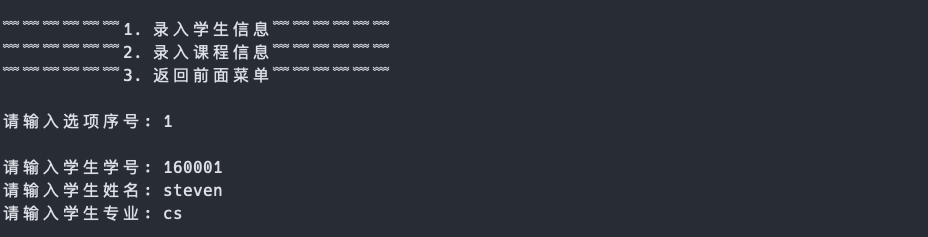
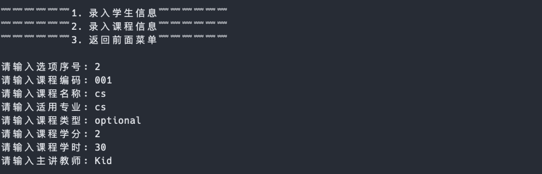
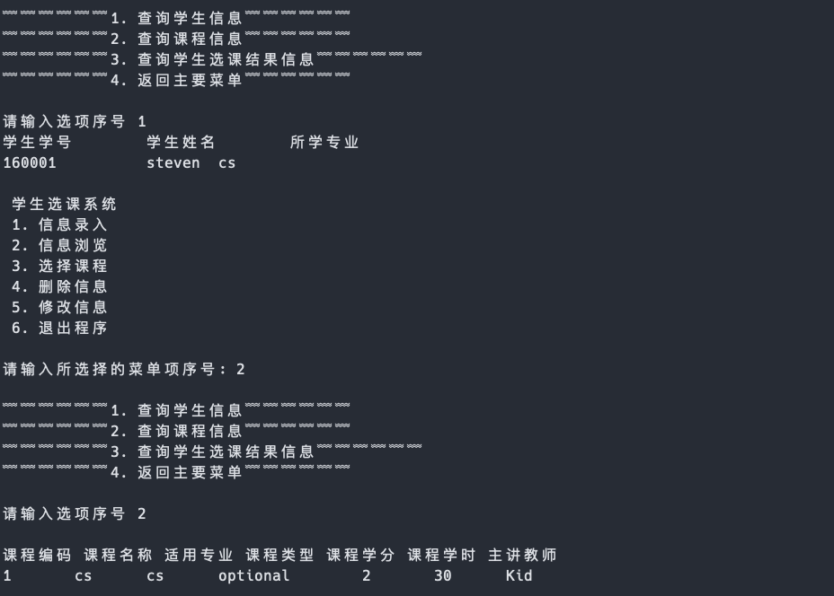

# Courses Selection System

> **Author: [StevenChaoo](https://github.com/StevenChaoo)**

This blog is written by **Neovim** and **Visual Studio Code**.

## Overview

## Sign up

## Show informations

## Select courses

## Delete users

## REFERENCE

1. [CSDN-蒙奇的嘉](https://blog.csdn.net/qq_42279953/article/details/88316106) with [CC 4.0 BY-SA ](https://creativecommons.org/licenses/by-sa/4.0)
